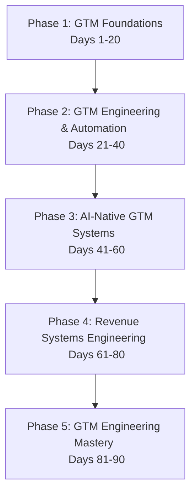

# 90 Days of Go-To-Market (GTM) Engineering Mastery

🚀 A comprehensive, structured 90-day hands-on journey to becoming a **Founding GTM Engineer** / **Revenue Systems Architect**.

Developed & Maintained by **Anand Kumar**
🔗 **GitHub**: [github.com/AnandKg22](https://github.com/AnandKg22) | 🔗 **LinkedIn**: [linkedin.com/in/anandkg22](https://www.linkedin.com/in/anandkg22/)

---

> [!WARNING]
> ### Legal Disclaimer & Terms of Use
>
> The educational materials, configurations, scripts, and commands provided in this repository are for study and general learning purposes only. Under no circumstances shall the author, contributors, or repository owner be held liable under any theory of law or jurisdiction for any direct, indirect, incidental, special, exemplary, or consequential damages (including, but not limited to, system downtime, data loss, network outages, financial loss, or security breaches) arising in any way out of the use of or reliance on this study material.
>
> You assume sole responsibility for your actions. Running configuration changes, shell scripts, docker containers, or network commands carries inherent risks. Always review, verify, and test commands in a safe, isolated sandbox environment before applying them to production systems.
>
> By accessing, cloning, reading, or continuing ahead with the material in this repository, you explicitly acknowledge and agree to take full and exclusive responsibility for any outcomes or modifications to your systems.

This repository serves as a learning curriculum, portfolio showcase, and operations journal covering B2B sales automation, CRM architectures, workflow automation, AI agents (RAG & Multi-Agent orchestration), PLG analytics, revenue pipelines, enterprise security, and SaaS infrastructure.

---

## 📅 Roadmap Overview



### 🎯 Core Curriculum Phases

| Phase | Days | Focus Area | Capstone Project |
| :--- | :--- | :--- | :--- |
| **Phase 1** | Days 1–20 | GTM Business, Sales, & CRM Fundamentals | AI SDR Assistant v1 |
| **Phase 2** | Days 21–40 | APIs, Data Modeling, & Workflow Automation | AI Revenue Automation Platform v1 |
| **Phase 3** | Days 41–60 | AI Agents, RAG, Evaluation & Observability | AI GTM Copilot |
| **Phase 4** | Days 61–80 | Revenue Systems, PLG, CDPs, & SLA Routing | Revenue OS |
| **Phase 5** | Days 81–90 | Cost Optimization, Security, Portfolio & Brand | GTM OS (Flagship Capstone) |

---

## 🛠 Technology Stack

- **Frontend**: Next.js, React, TypeScript, Tailwind CSS
- **Backend**: Node.js (NestJS / Express), Laravel, Python
- **Database & Storage**: PostgreSQL, Supabase, pgvector, Redis
- **Automation Engines**: n8n, Zapier, Make, Google Apps Script
- **GTM Platforms**: HubSpot API, Salesforce Composite & Bulk APIs
- **AI / LLMs**: OpenAI (GPT-4o), Anthropic (Claude 3.5 Sonnet), Gemini API, MCP (Model Context Protocol)
- **Infrastructure & Monitoring**: Docker, Traefik, OpenTelemetry, Grafana, GitHub Actions

---

## 📂 Repository Structure

This repository is organized logically to make daily tasks, reusable prompts, automation workflows, and core architecture documents easy to find and navigate:

```
90-days-of-gtm-engineering/
├── README.md                 # Root documentation and tracking dashboard
├── LICENSE                   # MIT License
├── CONTRIBUTING.md           # Guide for contributions
├── CODE_OF_CONDUCT.md        # Code of conduct
├── CHANGELOG.md              # Historical version updates
├── .github/                  # GitHub workflows & issue templates
├── assets/                   # Banners, media assets, and diagrams
├── docs/                     # Study guides, cheat sheets, and references
├── templates/                # Reusable email, proposal, and dashboard templates
├── prompts/                  # Reusable system and user prompt library
├── workflows/                # JSON exports for n8n, Zapier, and Make
├── agents/                   # Agent definition code and orchestration logic
├── projects/                 # Core sub-projects & capstone platforms
└── daily/                    # Day-by-day learning logs and exercises
    ├── Day-001-Introduction-to-GTM-Engineering/
    ├── Day-002-Understanding-Modern-SaaS/
    └── ...
```

---

## 📈 Daily Progress Tracker

Mark your progress as you work through the course!


### Phase 1: GTM Foundations (Days 1–20)
- [x] **Day 001**: [Introduction to GTM Engineering](daily/Day-001-Introduction-to-GTM-Engineering/README.md)
- [x] **Day 002**: [Understanding Modern SaaS](daily/Day-002-Understanding-Modern-SaaS/README.md)
- [x] **Day 003**: [Customer Journey](daily/Day-003-Customer-Journey/README.md)
- [x] **Day 004**: [Ideal Customer Profile (ICP)](daily/Day-004-ICP/README.md)
- [x] **Day 005**: [Market Segmentation](daily/Day-005-Market-Segmentation/README.md)
- [x] **Day 006**: [B2B Sales Fundamentals](daily/Day-006-B2B-Sales-Fundamentals/README.md)
- [x] **Day 007**: [Sales Roles](daily/Day-007-Sales-Roles/README.md)
- [x] **Day 008**: [CRM Fundamentals](daily/Day-008-CRM-Fundamentals/README.md)
- [x] **Day 009**: [HubSpot Architecture](daily/Day-009-CRM-Customization/README.md)
- [x] **Day 010**: [Salesforce Concepts](daily/Day-010-CRM-Pipelines/README.md)
- [x] **Day 011**: [Revenue Operations (RevOps)](daily/Day-011-Lead-Source/README.md)
- [x] **Day 012**: [Sales Funnel](daily/Day-012-B2B-SaaS-GTM-Infrastructure-Stack/README.md)
- [x] **Day 013**: [Lead Generation](daily/Day-013-Relational-DBs-Postgres/README.md)
- [x] **Day 014**: [Lead Qualification](daily/Day-014-Non-Relational-DBs-MongoDB/README.md)
- [x] **Day 015**: [Customer Research](daily/Day-015-APIs-Webhooks/README.md)
- [x] **Day 016**: [Sales Prospecting](daily/Day-016-Integration-Tools-n8n/README.md)
- [x] **Day 017**: [Sales Messaging](daily/Day-017-Reverse-ETL-Census-Hightouch/README.md)
- [x] **Day 018**: [Copywriting for GTM Engineers](daily/Day-018-CDP-Segment/README.md)
- [x] **Day 019**: [AI for GTM](daily/Day-019-Data-Warehouse-Concepts/README.md)
- [x] **Day 020**: [Building Your First GTM AI Agent](daily/Day-020-Data-Warehousing-BigQuery/README.md)

### Phase 2: GTM Automation (Days 21–40)
- [x] **Day 021**: [APIs for GTM Engineers](daily/Day-021-dbt-Data-Build-Tool/README.md)
- [x] **Day 022**: [HubSpot API Integration](daily/Day-022-Integration-Challenges/README.md)
- [x] **Day 023**: [Salesforce API Integration](daily/Day-023-API-Governance-Rate-Limits/README.md)
- [x] **Day 024**: [CRM Data Modeling](daily/Day-024-API-Versioning/README.md)
- [x] **Day 025**: [Workflow Automation](daily/Day-025-Capstone-Project-Ingestion-Pipeline/README.md)
- [x] **Day 026**: [n8n Fundamentals](daily/Day-026-Looker-Studio-Setup-Connections/README.md)
- [x] **Day 027**: [Zapier & Make](daily/Day-027-Looker-Studio-Adding-Fields-Custom-Queries/README.md)
- [x] **Day 028**: [Webhooks](daily/Day-028-Looker-Studio-Parameters-Filters/README.md)
- [x] **Day 029**: [Email Automation](daily/Day-029-Looker-Studio-Blending-Data-Sources/README.md)
- [x] **Day 030**: [AI Email Personalization](daily/Day-030-Cohort-Analysis/README.md)
- [x] **Day 031**: [Data Enrichment](daily/Day-031-Revenue-Metrics-MRR-ARR/README.md)
- [x] **Day 032**: [Lead Scoring Engine](daily/Day-032-Expansion-Metrics-NDR-GRR/README.md)
- [x] **Day 033**: [Building Internal GTM Tools](daily/Day-033-Efficiency-Metrics-LTV-CAC/README.md)
- [x] **Day 034**: [Analytics for GTM](daily/Day-034-Funnel-Metrics-Conversion-Rates/README.md)
- [x] **Day 035**: [SQL for GTM Engineers](daily/Day-035-Attribution-Models-Multi-touch/README.md)
- [x] **Day 036**: [AI Prompt Engineering for Sales](daily/Day-036-Data-Quality-Auditing/README.md)
- [x] **Day 037**: [Retrieval-Augmented Generation (RAG)](daily/Day-037-Data-Compliance-Governance-GDPR-CCPA/README.md)
- [x] **Day 038**: [Multi-Agent Systems](daily/Day-038-Security-Access-Control-RBAC-SSO/README.md)
- [x] **Day 039**: [Building GTM Dashboards](daily/Day-039-Building-GTM-Dashboards/README.md)
- [x] **Day 040**: [Phase 2 Capstone Project](daily/Day-040-Phase-2-Capstone-Project/README.md)

### Phase 3: AI-Native GTM Systems (Days 41–60)
- [x] **Day 041**: [AI Agent Fundamentals](daily/Day-041-AI-Agent-Fundamentals/README.md)
- [x] **Day 042**: [Model Context Protocol (MCP)](daily/Day-042-Model-Context-Protocol-(MCP)/README.md)
- [x] **Day 043**: [Agent Orchestration](daily/Day-043-Agent-Orchestration/README.md)
- [x] **Day 044**: [AI Research Agent](daily/Day-044-AI-Research-Agent/README.md)
- [x] **Day 045**: [AI SDR Agent](daily/Day-045-AI-SDR-Agent/README.md)
- [x] **Day 046**: [AI Meeting Preparation Agent](daily/Day-046-AI-Meeting-Preparation-Agent/README.md)
- [x] **Day 047**: [AI Proposal Generator](daily/Day-047-AI-Proposal-Generator/README.md)
- [x] **Day 048**: [AI Customer Success Agent](daily/Day-048-AI-Customer-Success-Agent/README.md)
- [x] **Day 049**: [AI Knowledge Assistant](daily/Day-049-AI-Knowledge-Assistant/README.md)
- [x] **Day 050**: [AI Call Analysis](daily/Day-050-AI-Call-Analysis/README.md)
- [x] **Day 051**: [Experimentation & A/B Testing](daily/Day-051-Experimentation-AB-Testing/README.md)
- [x] **Day 052**: [Personalization at Scale](daily/Day-052-Personalization-at-Scale/README.md)
- [x] **Day 053**: [Revenue Analytics](daily/Day-053-Revenue-Analytics/README.md)
- [x] **Day 054**: [Customer Journey Analytics](daily/Day-054-Customer-Journey-Analytics/README.md)
- [x] **Day 055**: [AI Evaluation & Guardrails](daily/Day-055-AI-Evaluation-Guardrails/README.md)
- [x] **Day 056**: [Observability for AI Systems](daily/Day-056-Observability-for-AI-Systems/README.md)
- [x] **Day 057**: [Security & Compliance in GTM](daily/Day-057-Security-Compliance-in-GTM/README.md)
- [x] **Day 058**: [Building an AI GTM Platform](daily/Day-058-Building-an-AI-GTM-Platform/README.md)
- [x] **Day 059**: [Performance Optimization](daily/Day-059-Performance-Optimization/README.md)
- [x] **Day 060**: [Phase 3 Capstone Project](daily/Day-060-Phase-3-Capstone-Project/README.md)

### Phase 4: Revenue Systems (Days 61–80)
- [x] **Day 061**: [Revenue Architecture](daily/Day-061-Revenue-Architecture/README.md)
- [x] **Day 062**: [Product-Led Growth (PLG)](daily/Day-062-Product-Led-Growth-(PLG)/README.md)
- [x] **Day 063**: [Usage Analytics](daily/Day-063-Usage-Analytics/README.md)
- [x] **Day 064**: [Customer Data Platform (CDP)](daily/Day-064-Customer-Data-Platform-(CDP)/README.md)
- [x] **Day 065**: [Marketing Automation](daily/Day-065-Marketing-Automation/README.md)
- [x] **Day 066**: [Revenue Forecasting](daily/Day-066-Revenue-Forecasting/README.md)
- [x] **Day 067**: [Customer Health Scoring](daily/Day-067-Customer-Health-Scoring/README.md)
- [x] **Day 068**: [Churn Prevention Systems](daily/Day-068-Churn-Prevention-Systems/README.md)
- [x] **Day 069**: [Expansion Revenue Systems](daily/Day-069-Expansion-Revenue-Systems/README.md)
- [x] **Day 070**: [Executive Dashboards](daily/Day-070-Executive-Dashboards/README.md)
- [x] **Day 071**: [AI Revenue Intelligence](daily/Day-071-AI-Revenue-Intelligence/README.md)
- [x] **Day 072**: [AI Account Intelligence](daily/Day-072-AI-Account-Intelligence/README.md)
- [x] **Day 073**: [AI Sales Coaching](daily/Day-073-AI-Sales-Coaching/README.md)
- [x] **Day 074**: [AI Customer Success Copilot](daily/Day-074-AI-Customer-Success-Copilot/README.md)
- [x] **Day 075**: [AI Revenue Operations](daily/Day-075-AI-Revenue-Operations/README.md)
- [x] **Day 076**: [Enterprise Integrations](daily/Day-076-Enterprise-Integrations/README.md)
- [x] **Day 077**: [Enterprise AI Governance](daily/Day-077-Enterprise-AI-Governance/README.md)
- [x] **Day 078**: [GTM Platform Engineering](daily/Day-078-GTM-Platform-Engineering/README.md)
- [x] **Day 079**: [Enterprise Deployment](daily/Day-079-Enterprise-Deployment/README.md)
- [x] **Day 080**: [Phase 4 Capstone Project](daily/Day-080-Phase-4-Capstone-Project/README.md)

### Phase 5: GTM Engineering Mastery (Days 81–90)
- [x] **Day 081**: [Production GTM Architecture](daily/Day-081-Production-GTM-Architecture/README.md)
- [x] **Day 082**: [Enterprise Security](daily/Day-082-Enterprise-Security/README.md)
- [x] **Day 083**: [Cost Engineering & FinOps](daily/Day-083-Cost-Engineering-FinOps/README.md)
- [x] **Day 084**: [Open Source GTM Engineering](daily/Day-084-Open-Source-GTM-Engineering/README.md)
- [x] **Day 085**: [GTM System Design Interviews](daily/Day-085-GTM-System-Design-Interviews/README.md)
- [x] **Day 086**: [Technical Leadership](daily/Day-086-Technical-Leadership/README.md)
- [x] **Day 087**: [Building Your Personal Brand](daily/Day-087-Building-Your-Personal-Brand/README.md)
- [x] **Day 088**: [GTM Engineering Interview Preparation](daily/Day-088-GTM-Engineering-Interview-Preparation/README.md)
- [x] **Day 089**: [Portfolio Capstone](daily/Day-089-Portfolio-Capstone/README.md)
- [x] **Day 090**: [Final Master Capstone](daily/Day-090-Final-Master-Capstone/README.md)

---

## 👤 Author & Connect

Developed with 💙 by **Anand Kumar** — GTM Systems Architect & Revenue Engineer.

*   **GitHub**: [@AnandKg22](https://github.com/AnandKg22)
*   **LinkedIn**: [Anand Kumar on LinkedIn](https://www.linkedin.com/in/anandkg22/)
*   **Portfolio Repository**: [90-days-of-gtm-engineering](https://github.com/AnandKg22/90-days-of-gtm-engineering)

---

## 📄 Repository Administrative Files

- [License](LICENSE) - MIT License.
- [Contributing Guidelines](CONTRIBUTING.md) - How to collaborate.
- [Code of Conduct](CODE_OF_CONDUCT.md) - Community rules.
- [Changelog](CHANGELOG.md) - History of learning commits.
