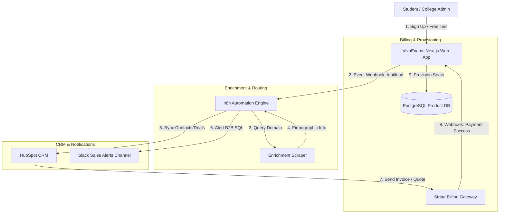

# GTM Architecture - Day 001: VivaExams Go-To-Market Stack

This document details the system integrations and data flow architecture designed for the VivaExams GTM engine.

---

## 🗺️ GTM Systems Architecture

Below is a sequence architecture showing how data traverses the product portal, webhook routing engine, HubSpot CRM, and Stripe billing:

---

## 🔄 Core Data Flow Steps

1.  **Lead Intake**: The user submits their email on the Next.js portal. The portal sends a JSON payload to our n8n webhook intake endpoint.
2.  **Enrichment Step**: The n8n engine extracts the email domain. If it is an institutional domain (e.g., `.edu`), it scrapes web metadata or calls our internal scraper to extract the institution name and enrollment statistics.
3.  **CRM Synchronization**: n8n formats the payload into a standard HubSpot CRM contact object. It creates or updates the Contact and Company records.
4.  **B2B Routing Alert**: If the contact is identified as a B2B college admin, n8n pushes a formatted message to Slack with a HubSpot profile link, assigning the lead to an Account Executive.
5.  **Billing & Provisioning Loop**: When a deal closes, Stripe handles billing. Stripe sends an event notification back to our API gateway upon payment success, which triggers database SQL scripts to provision license seats inside the PostgreSQL application database.
