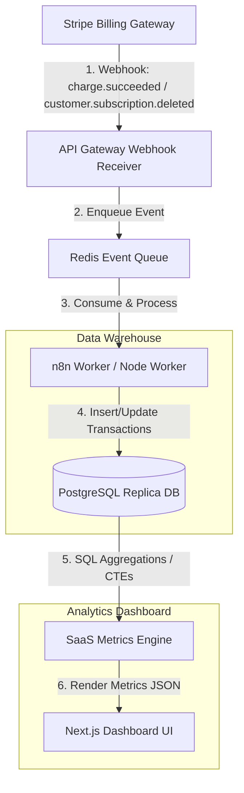

# GTM Architecture - Day 002: Revenue Dashboard Telemetry Flow

This document details the telemetry architecture that feeds the Revenue Dashboard with real-time billing transaction states.

---

## 🔄 Billing to Analytics Data Flow

Below is the event-driven data flow that captures payment changes and aggregates them into the revenue metrics engine:

---

## 📂 Data Schema Telemetry

The billing webhook pushes structured transaction logs. To calculate MRR, CAC, and Churn, we track subscription states:

*   `customer.subscription.created`: Adds new ARR, adds a customer, records their CAC (tied to their UTM/ad click history).
*   `customer.subscription.updated`: Captures plan changes (expansion/contraction MRR).
*   `customer.subscription.deleted`: Triggers a Churn event, marking the status as `Churned` and calculating customer lifetime span.
*   `invoice.payment_succeeded`: Confirms active status and gross revenue.
