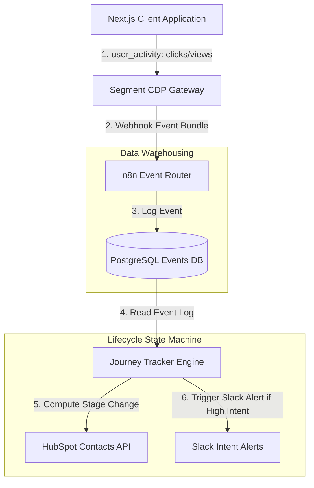

# GTM Architecture - Day 003: Journey Tracking State Engine

This document details the telemetry tracking architecture that powers the lifecycle state transitions of the Journey Mapping Board.

---

## 🔄 Client-Side Telemetry Flow

The diagram below shows how raw clicks and signups are captured, validated, and used to update the contact's pipeline stage:



---

## 📂 Webhook Event Payloads

### 1. Page View Event (Visitor State)
Captured when a user lands on key pages:
```json
{
  "user_id": "usr_9921",
  "event_name": "page_view",
  "properties": {
    "url": "/pricing",
    "referrer": "google.com"
  }
}
```

### 2. Form Signup Event (Lead State)
Fired when the user signs up for a trial account:
```json
{
  "user_id": "usr_9921",
  "event_name": "form_signup",
  "properties": {
    "email": "alex.dev@acmecorp.com",
    "company": "Acme Corp"
  }
}
```
