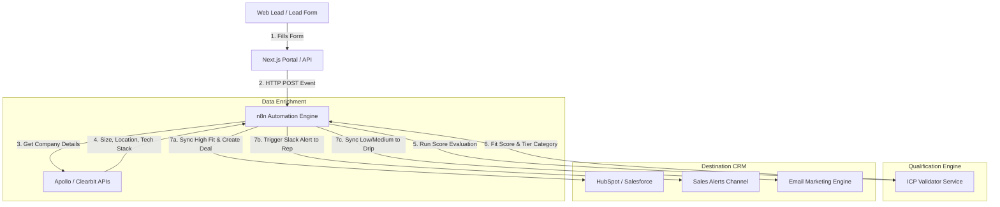

# GTM Architecture - Day 004: ICP Lead Qualification Flow

This document details the systems design blueprint mapping automated lead intake, third-party firmographic enrichment, and programmatic ICP validation.

---

## 🔄 Lead Scoring & CRM Sync Pipeline

The sequence diagram below details how lead records are captured, validated, and categorized:

---

## ⚙️ Pipeline System Rules

1.  **Form Submission**: Submits basic email (e.g. `dean@tolani.edu`).
2.  **Enrichment Lookup**: Resolves the email domain to retrieve company details:
    *   Name: `Tolani Maritime Academy`
    *   Employees: `120`
    *   Country: `IN`
    *   Technologies: `["Moodle", "Stripe"]`
3.  **ICP Scoring**: The `ICPValidator` runs, outputting a score of `90/100` (`High Fit`).
4.  **Routing Split**:
    *   *High Fit leads* immediately spawn a HubSpot Contact & Company, link them, create a Deal in the Enterprise Pipeline, and alert sales.
    *   *Medium & Low Fit leads* are placed into low-touch email drip sequences to nurture them.
