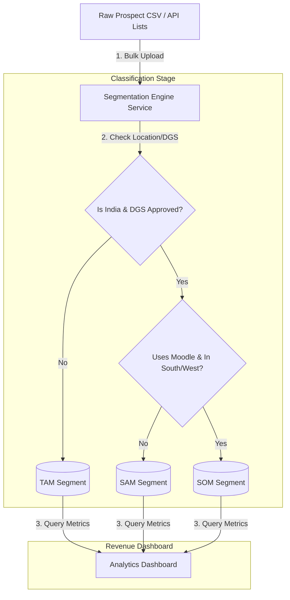

# GTM Architecture - Day 005: Market Segmentation Pipeline

This document details the data pipeline architecture that automates market segmentation and TAM/SAM/SOM classification inside our database.

---

## 🔄 Market Segmentation Data Flow

The diagram below details how raw prospect records are classified, valued, and visualized:



---

## ⚙️ SQL Segmentation Rules

To run these segments directly in the PostgreSQL database replica, the dashboard queries use conditional SQL grouping:

```sql
-- Compute TAM/SAM/SOM segment counts and contract values
SELECT 
    COUNT(id) AS tam_count,
    SUM(8000) AS tam_value,
    
    COUNT(id) FILTER(WHERE country = 'IN' AND dgs_approved = true) AS sam_count,
    SUM(8000) FILTER(WHERE country = 'IN' AND dgs_approved = true) AS sam_value,
    
    COUNT(id) FILTER(WHERE country = 'IN' AND dgs_approved = true 
                       AND region IN ('West', 'South') 
                       AND 'Moodle' = ANY(tech_stack)) AS som_count,
    SUM(8000) FILTER(WHERE country = 'IN' AND dgs_approved = true 
                       AND region IN ('West', 'South') 
                       AND 'Moodle' = ANY(tech_stack)) AS som_value
FROM academy_prospects;
```
