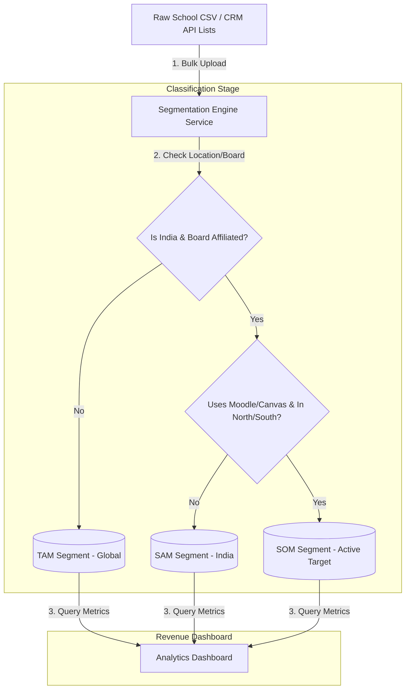

# GTM Architecture - Day 005: Market Segmentation Pipeline

This document details the data pipeline architecture that automates market segmentation and TAM/SAM/SOM classification inside our database.

---

## 🔄 Market Segmentation Data Flow

The diagram below details how raw school and coaching center lead records are classified, valued, and visualized:



---

## ⚙️ SQL Segmentation Rules

To run these segments directly in our PostgreSQL database replica, the analytics dashboard queries use conditional SQL grouping. The base annual contract value is set to **$1,200** per school:

```sql
-- Compute TAM/SAM/SOM segment counts and contract values
SELECT 
    -- TAM: All schools in the system
    COUNT(id) AS tam_count,
    SUM(1200) AS tam_value,
    
    -- SAM: Board-affiliated schools located in India
    COUNT(id) FILTER(WHERE country = 'IN' AND is_board_affiliated = true) AS sam_count,
    SUM(1200) FILTER(WHERE country = 'IN' AND is_board_affiliated = true) AS sam_value,
    
    -- SOM: Indian, board-affiliated schools running Moodle/Canvas in North or South regions
    COUNT(id) FILTER(WHERE country = 'IN' AND is_board_affiliated = true 
                       AND region IN ('North', 'South') 
                       AND ('Moodle' = ANY(tech_stack) OR 'Canvas' = ANY(tech_stack))) AS som_count,
    SUM(1200) FILTER(WHERE country = 'IN' AND is_board_affiliated = true 
                       AND region IN ('North', 'South') 
                       AND ('Moodle' = ANY(tech_stack) OR 'Canvas' = ANY(tech_stack))) AS som_value
FROM school_prospects;
```
