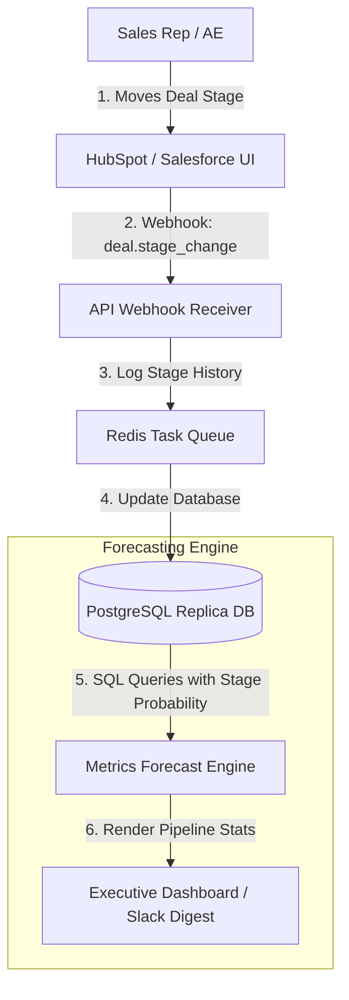

# GTM Architecture - Day 006: Sales Pipeline & Forecasting

This document details the sales pipeline architecture and data flows that update deal statuses and calculate revenue projections.

---

## 🔄 Sales Stage Updates & Forecast Data Flow

The diagram below details how deal movements in the CRM trigger database syncs and recalculate weighted pipeline valuations:



---

## 📂 Webhook Event Payload

When an AE moves a deal's stage in HubSpot, it fires a webhook payload:

```json
{
  "event": "deal.stage_change",
  "deal_id": "d_001",
  "properties": {
    "deal_name": "Tolani Maritime Academy",
    "amount": 10000.00,
    "old_stage": "Discovery",
    "new_stage": "Proposal",
    "last_updated": "2026-07-13T15:16:00Z"
  }
}
```

This payload is consumed by the Webhook Receiver and updates the active stage in our Postgres database replica. The analytics dashboard then runs the weighted sum queries to update forecast statistics.
