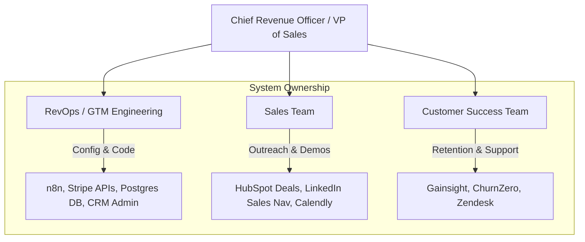

# GTM Architecture - Day 007: Sales Org Structure & Tools Ownership

This document details the sales organization structure, roles, and software tool boundaries within the commercial stack.

---

## 🛠️ Sales Org Structure & Tool Hierarchy

Below is the commercial organization tree, mapping each team member to their primary software tools and databases:

---

## 📂 Ownership Matrices

| Role | Core Mission | Primary CRM Objects | Primary Software Stack |
| :--- | :--- | :--- | :--- |
| **SDR/BDR** | Qualify Leads | Contacts, Activities | Apollo.io, LinkedIn Sales Navigator, HubSpot (Inbox) |
| **AE** | Close Deals | Contacts, Companies, Deals | HubSpot (Deals Board), Calendly, Zoom |
| **CSM** | Retain Customers | Contacts, Companies, CS tickets | Gainsight, Zendesk, Product Admin Panel |
| **RevOps/GTM** | Build Infrastructure | All Objects + Database Replica | n8n Workflows, Stripe Billing, Postgres, Docker, pgvector |
