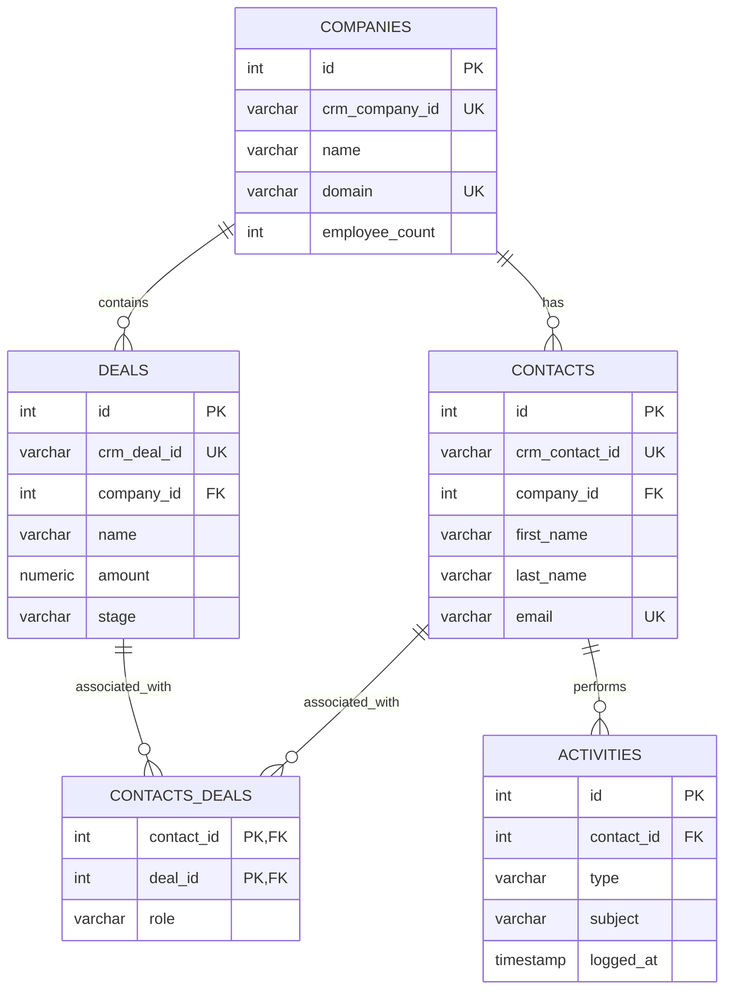

# GTM Architecture - Day 008: CRM Entity Relationship Diagram

This document contains the Entity Relationship Diagram (ERD) mapping CRM tables, custom fields, and key relations.

---

## 🗄️ CRM Schema Entity Relationship Diagram (ERD)

The diagram below details how Contacts, Companies, Deals, and Activities are linked via relational database foreign keys:

---

## ⚙️ Relationship Cardinality Definitions

*   **Companies to Contacts (One-to-Many)**: A Company record can contain multiple related contacts (e.g. `AMET University` links to Anil, Ravi, and Sunil).
*   **Companies to Deals (One-to-Many)**: A single organization account can have multiple deals open over time (e.g., first license purchase, followed by an expansion deal).
*   **Contacts to Deals (Many-to-Many)**: Resolved via the junction table `CONTACTS_DEALS`. It links multiple buying committee members (such as Champions, Economic Buyers, and Technical Evaluators) to a single deal.
