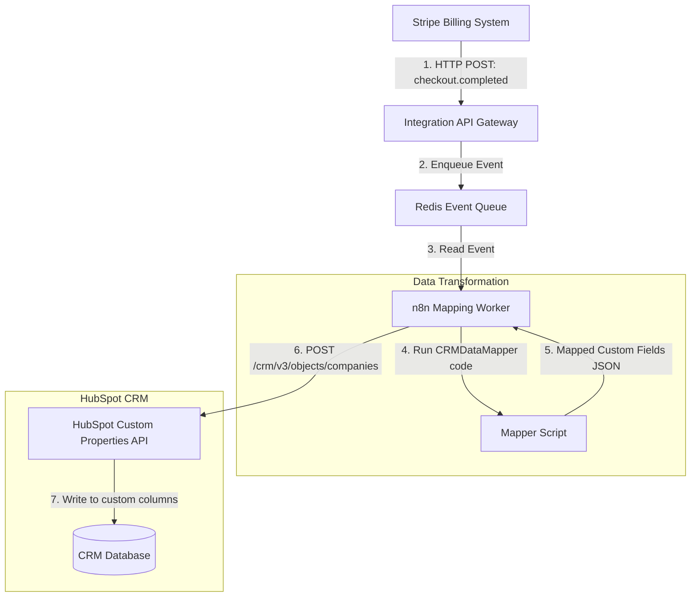

# GTM Architecture - Day 009: Webhook Custom Field Mapping

This document details the webhook integration design mapping transactional updates directly to CRM custom properties.

---

## 🔄 Stripe-to-CRM Webhook Integration Flow

The diagram below details the end-to-end webhook data path, conversion, and syncing steps:

---

## ⚙️ Data Mapping Transformations

The n8n worker applies transformation functions during the mapping phase:

1.  **Format Multi-select Dropdown List**: Converts Stripe's comma-separated text `"SYNERGY, FLEET"` into a JSON array `["SYNERGY", "FLEET"]` to match HubSpot's multi-select schema requirements.
2.  **Cast String to Float**: Converts numeric inputs to float format to fit custom CRM number properties.
3.  **Sanitize Boolean Checkboxes**: Standardizes raw API triggers (e.g. converting `1`, `yes`, or `"true"` to a boolean `True`) to prevent CRM schema validation failures.
