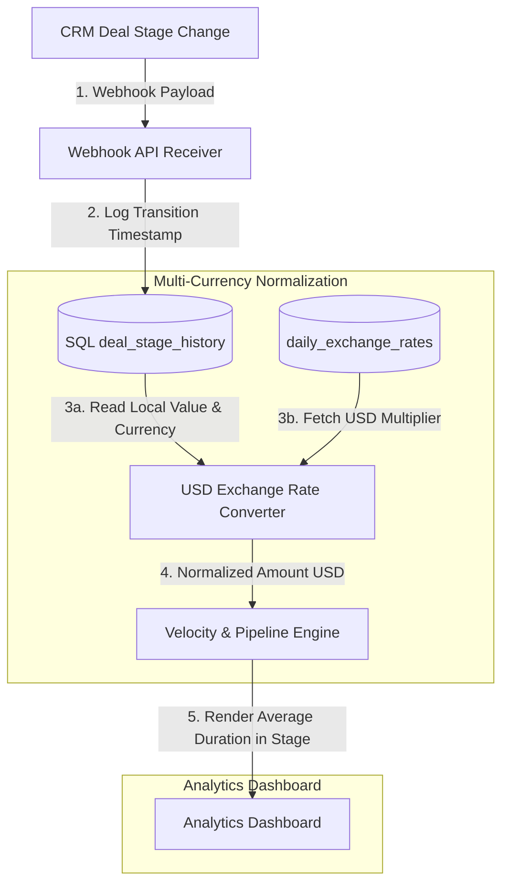

# GTM Architecture - Day 010: Pipeline Velocity & Multi-Currency Schema

This document details the database schema configurations and transaction handlers that calculate stage velocity and exchange rate normalizations.

---

## 🔄 Pipeline Velocity & Multi-Currency Data Flow

The diagram below details how transition events are logged, and how localized valuations are normalized:



---

## ⚙️ SQL Schema for Pipeline Velocity

To track velocity in PostgreSQL, we configure a dedicated audit table:

```sql
CREATE TABLE deal_stage_history (
    id SERIAL PRIMARY KEY,
    deal_id VARCHAR(100) NOT NULL,
    stage_name VARCHAR(100) NOT NULL,
    entered_at TIMESTAMP NOT NULL,
    exited_at TIMESTAMP,
    duration_seconds INT GENERATED ALWAYS AS (EXTRACT(EPOCH FROM (exited_at - entered_at))) STORED
);
```

When a deal changes stages:
1.  The active stage history record has its `exited_at` column set to `NOW()`.
2.  A new record for the incoming stage is inserted, setting `entered_at` to `NOW()`.
3.  The generated column `duration_seconds` automatically computes the velocity value, allowing instantaneous stage cohort reports.
