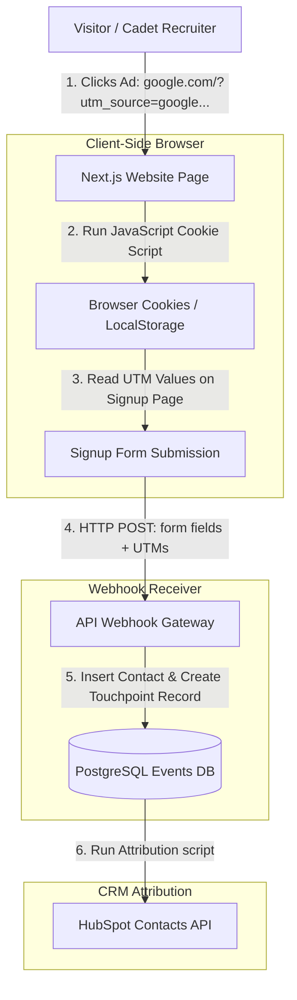

# GTM Architecture - Day 011: UTM Tracking & Lead Capture

This document details the front-end cookie-capture architecture that tracks traffic campaigns and matches them to CRM records.

---

## 🔄 UTM Cookie & Form Sync Data Flow

The diagram below details the client-to-server data flow that passes UTM query parameters during form submissions:



---

## ⚙️ JavaScript Cookie Capture Snippet

The front-end utilizes a script to extract UTM query parameters and store them in the user's browser session. When the registration form is clicked, these hidden properties are attached to the post request:

```javascript
// Extract UTM parameters from URL query string
function getUtmParams() {
    const urlParams = new URLSearchParams(window.location.search);
    const utms = {};
    const utmKeys = ['utm_source', 'utm_medium', 'utm_campaign', 'utm_term', 'utm_content'];
    
    utmKeys.forEach(key => {
        if (urlParams.has(key)) {
            utms[key] = urlParams.get(key);
            // Save in cookie for 30 days
            document.cookie = `${key}=${urlParams.get(key)}; max-age=2592000; path=/`;
        }
    });
    return utms;
}
```
