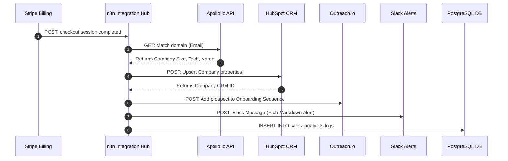

# GTM Architecture - Day 012: B2B SaaS Infrastructure Stack Blueprint

This document details the multi-system B2B SaaS stack integration blueprint, outlining api boundaries and database syncs.

---

## 🛠️ Complete GTM Stack Blueprint Sequence

The diagram below details the end-to-end integration path. It shows how customer payments trigger automated data enrichment, CRM syncing, marketing sequence additions, Slack alerts, and database logs:



---

## 📂 System API Specifications

### 1. Apollo.io Match API
*   **Method**: `POST`
*   **URL**: `https://api.apollo.io/v1/people/match`
*   **Header**: `Content-Type: application/json`, `X-Api-Key: ******`
*   **Response mapping**: Extracted keys `organization.name`, `organization.estimated_num_employees`, `organization.technologies`.

### 2. HubSpot Companies API
*   **Method**: `POST`
*   **URL**: `https://api.hubapi.com/crm/v3/objects/companies`
*   **Header**: `Authorization: Bearer OAuth_Token`
*   **Payload structure**:
    ```json
    {
      "properties": {
        "name": "IMSGOA Maritime College",
        "cadet_seats_purchased": 150,
        "sponsoring_shipping_lines": ["Moodle", "Stripe"]
      }
    }
    ```
