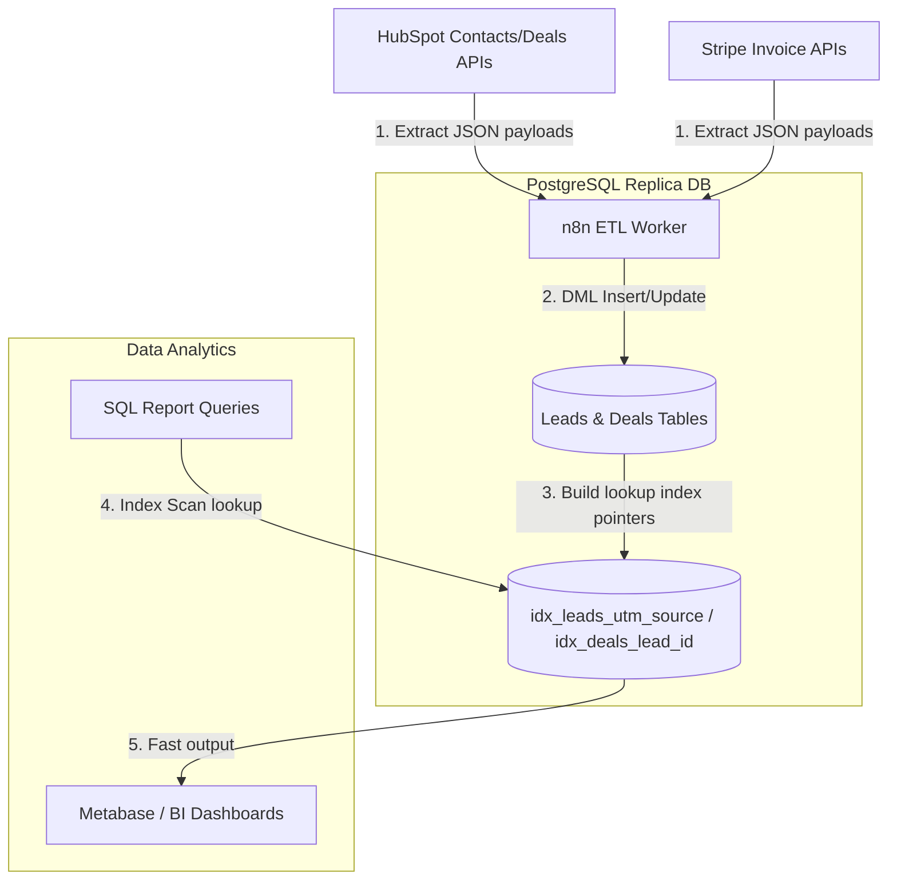

# GTM Architecture - Day 013: PostgreSQL Data Replication & Indexes

This document details the database architecture of our GTM replica data warehouse, illustrating replication pipelines and index performance designs.

---

## 🔄 Replica Database Pipeline Flow

The diagram below details the data replication flow, showing how API datasets are extracted, structured, and queried:



---

## ⚙️ Index Optimization Mechanics

Without indexes, when you run a query filtering by a lead source (e.g. `WHERE utm_source = 'google'`), the database must perform a **Full Table Scan**. It opens and reads every single row in the `leads` table. If the table contains 1,000,000 leads, this takes several seconds and exhausts server memory.

### Index Scan (B-Tree Search)
By creating the B-Tree index:
```sql
CREATE INDEX idx_leads_utm_source ON leads(utm_source);
```
The database constructs an ordered, self-balancing tree mapping sources to row locations. When filtering by `'google'`, the database jumps directly to the matching rows. This converts a linear search $O(N)$ into a logarithmic search $O(\log N)$, executing queries in milliseconds.
