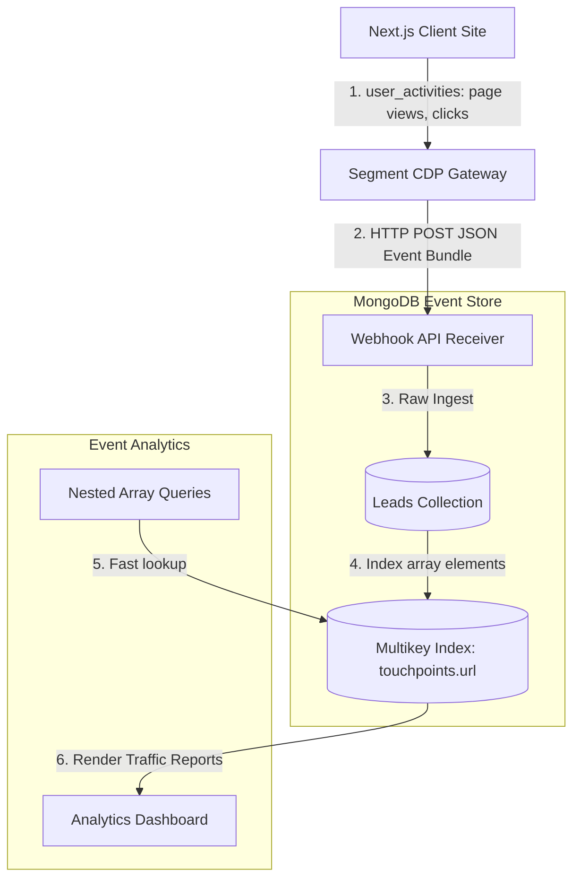

# GTM Architecture - Day 014: MongoDB Document Storage & Clickstreams

This document details the database architecture of our NoSQL GTM events database, illustrating clickstream ingest pipelines and document indexing plans.

---

## 🔄 NoSQL Clickstream Ingest Flow

The diagram below details the real-time event pipeline, showing how unstructured telemetry is captured and stored:



---

## ⚙️ Document Indexing Specifications

To search nesting arrays quickly as database records scale, we configure two NoSQL index models:

### 1. Compound Index (Multi-field search)
Optimizes queries filtering by both country and company size:
```javascript
db.leads.createIndex({ "country": 1, "employee_count": -1 });
```

### 2. Multikey Index (Nested Array search)
Optimizes search filters auditing user touchpoint URLs. Creating this index maps each object inside the `touchpoints` array individually:
```javascript
db.leads.createIndex({ "touchpoints.url": 1 });
```
This converts linear scans searching the nested array into B-Tree index scans, executing lookups in milliseconds.
