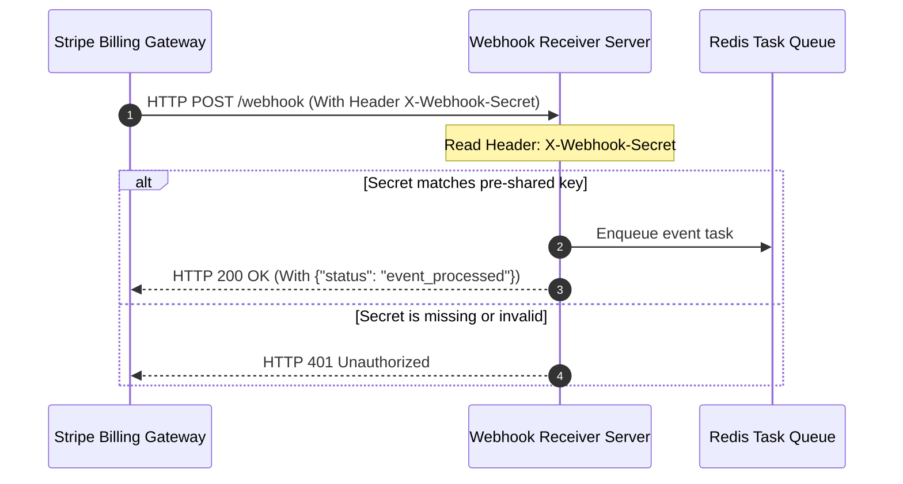

# GTM Architecture - Day 015: HTTP Webhook Receiver Server

This document details the webhook server architecture, demonstrating signature validation and response code loops.

---

## 🔄 Webhook Receiver Request Sequence

The diagram below details the transaction sequence and header checks executed by the webhook server:



---

## 📂 Webhook Ingest Payload Schema

### 1. Inbound POST Request Headers
*   `Host`: `localhost:8080`
*   `X-Webhook-Secret`: `vivaexams_secret_token_1120`
*   `Content-Type`: `application/json`
*   `Content-Length`: `108`

### 2. Request Body Payload
```json
{
  "event_name": "stripe.payment_intent.succeeded",
  "data": {
    "amount": 8000.00,
    "customer": "dean@imsgoa.org"
  }
}
```

### 3. Response payload (Status 200 OK)
```json
{
  "status": "event_processed",
  "received": true
}
```
