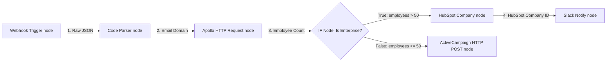

# GTM Architecture - Day 016: n8n Node Workflows

This document details the visual node graph architecture of our GTM sync pipeline built inside n8n.

---

## 🔄 n8n Node Connections Schema

Below is the n8n node configuration schema mapping parameters and conditional outputs:



---

## ⚙️ JSON Connection Contract

The pipeline connections are linked in the n8n engine using graph edge declarations. Each output node indexes its next target:

```json
"Is Enterprise?": {
  "main": [
    [
      {
        "node": "Upsert HubSpot Company",
        "type": "main",
        "index": 0
      }
    ],
    [
      {
        "node": "Add to Nurture Drip",
        "type": "main",
        "index": 0
      }
    ]
  ]
}
```

This ensures that:
*   **Branch `0` (True)** routes to the HubSpot Enterprise upsert node.
*   **Branch `1` (False)** routes to the ActiveCampaign B2C email nurturing node.
