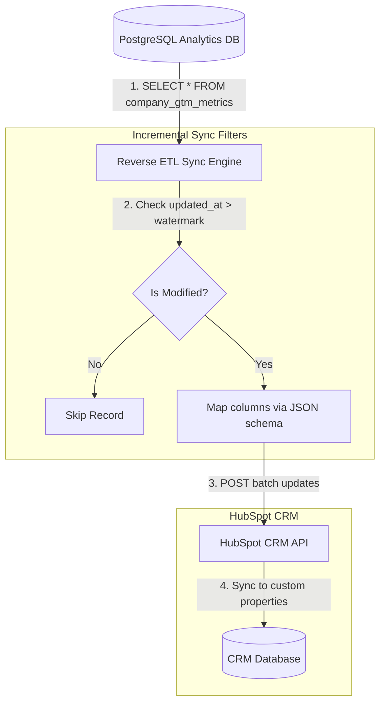

# GTM Architecture - Day 017: Reverse ETL Warehouse Sync

This document details the Reverse ETL pipeline architecture, demonstrating incremental sync filters and data transformation layouts.

---

## 🔄 Reverse ETL Sync Pipeline

The diagram below details the data flow from PostgreSQL tables, through the sync logic, and into the HubSpot CRM API:



---

## ⚙️ Schema Mapping JSON Contract

The properties mappings are declared in the Census/Hightouch sync engine as a JSON metadata configuration:

```json
{
  "source": {
    "type": "postgresql_view",
    "name": "company_gtm_metrics",
    "key_column": "company_domain"
  },
  "destination": {
    "type": "hubspot_companies",
    "key_property": "domain"
  },
  "mappings": [
    { "source_column": "total_exams_completed", "destination_property": "cadet_exams_completed" },
    { "source_column": "average_pass_rate", "destination_property": "exam_pass_rate_percent" },
    { "source_column": "health_status", "destination_property": "customer_health_status" }
  ]
}
```
