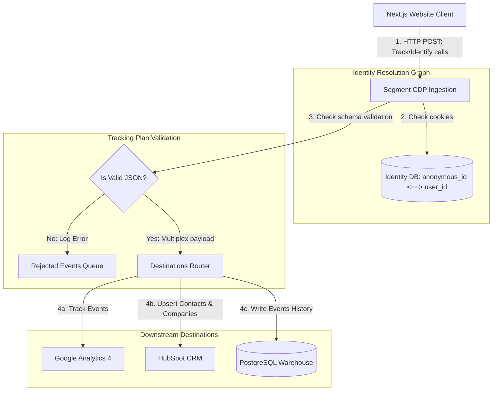

# GTM Architecture - Day 018: Customer Data Platform (Segment)

This document details the CDP architecture, demonstrating identity resolution mappings and multiplexing endpoints.

---

## 🔄 Segment Event Routing & Identity Resolution

The diagram below details the path of telemetry events from browser actions, through identity graphs, to multiple integrations:



---

## ⚙️ Segment API Payload Specifications

### 1. Identify Call (Identity Mapping)
Establishes the link between sessions and traits:
```json
{
  "userId": "usr_9901",
  "anonymousId": "anon_session_881023",
  "type": "identify",
  "traits": {
    "email": "captain@imsgoa.org",
    "name": "Vikram Singh"
  }
}
```

### 2. Group Call (Account Mapping)
Links the identified user to their B2B Company ID:
```json
{
  "userId": "usr_9901",
  "groupId": "org_imsgoa",
  "type": "group",
  "traits": {
    "name": "IMSGOA Maritime College",
    "employees": 85
  }
}
```
