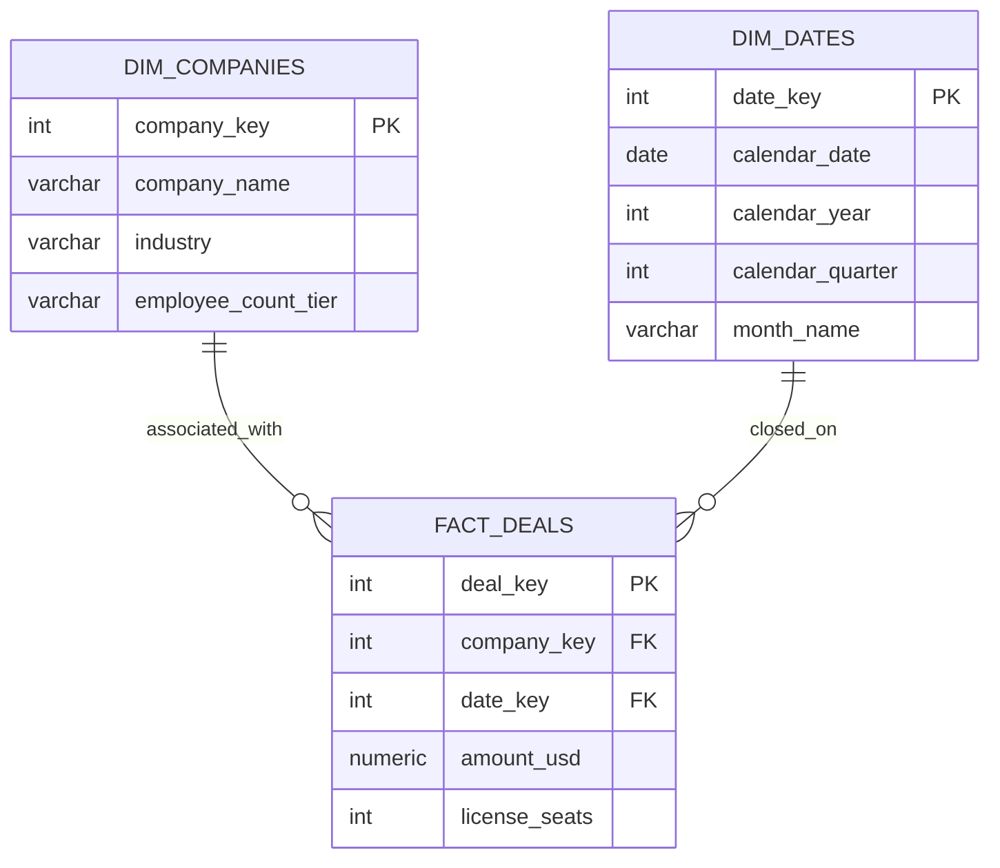

# GTM Architecture - Day 019: Data Warehouse Star Schema

This document details the Star Schema database architecture of our GTM Cloud Data Warehouse replica, demonstrating staging, dimension, and fact structures.

---

## 🗄️ Analytical Star Schema ERD

The diagram below details the table structures and join keys that construct our database model:

---

## ⚙️ ETL Data Pipeline Schema

1.  **Extract**: Raw JSON payloads from billing (Stripe) and sales (HubSpot) webhooks are loaded directly into denormalized staging tables (`stg_companies`, `stg_deals`).
2.  **Transform**:
    *   `stg_companies.employees` is processed to evaluate the `employee_count_tier` string (e.g. `120` employees mapped to `'Mid-Market (51-200)'`).
    *   `stg_deals.close_date` is parsed to extract calendar year, quarter, month name, and numeric date key (e.g. `"2026-03-15"` converted to key `20260315`).
3.  **Load**: Insert the cleaned records into normalized dimension (`dim_companies`, `dim_dates`) and fact (`fact_deals`) tables.
