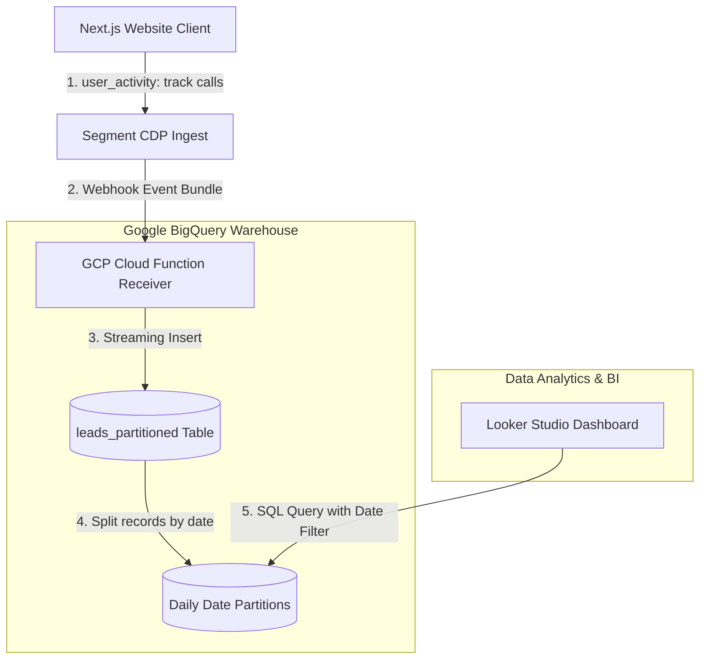

# GTM Architecture - Day 020: Google BigQuery Ingestion Pipeline

This document details the Google Cloud Platform (GCP) GTM architecture that streams telemetry logs into partitioned BigQuery collections.

---

## 🔄 GCP Telemetry to BigQuery Pipeline Flow

The diagram below details the data flow from client website events, through cloud serverless functions, into BigQuery storage:

---

## ⚙️ BigQuery Table Configuration

To ensure query performance and minimize data scanning costs, we configure GTM tables in BigQuery as follows:

1.  **Date Partitioning**: The table is partitioned by the transaction's creation date (`created_date`). Queries that target specific dates (such as today's performance report) will bypass all other daily partitions, scanning only matching rows.
2.  **Clustering**: The table is clustered by `company_name` and `utm_source`. BigQuery sorts rows with matching values close to each other on storage disk, allowing high-performance filtering.
