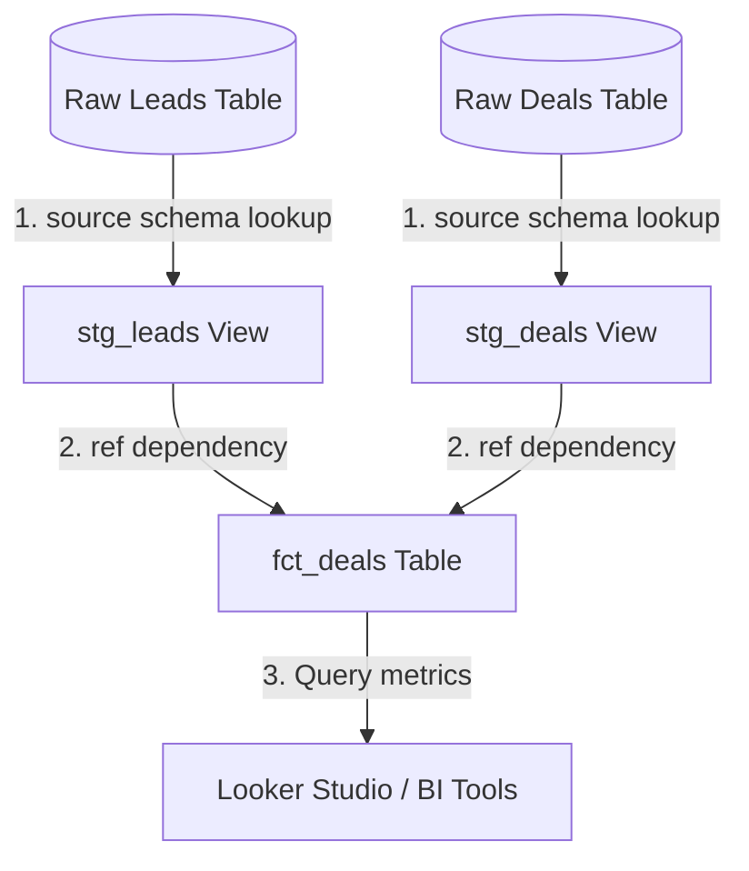

# GTM Architecture - Day 021: dbt DAG Transform Pipeline

This document details the analytics pipeline architecture built using dbt DAG models inside the cloud data warehouse.

---

## 🔄 dbt DAG Dependency Graph

The diagram below details the data transformation sequence, showing how raw tables are modularly compiled into cleaned views and final business tables:



---

## ⚙️ dbt Schema Testing Specs

Data quality is verified by applying constraint assertions in `marts/schema.yml`. dbt executes SQL tests during compilation:

1.  **`unique` constraint**: Asserts that every ID appears exactly once:
    ```sql
    SELECT deal_id FROM fct_deals GROUP BY deal_id HAVING COUNT(1) > 1
    ```
2.  **`not_null` constraint**: Asserts that no key is null:
    ```sql
    SELECT COUNT(1) FROM fct_deals WHERE deal_id IS NULL
    ```

If either query returns rows, the test fails, alerting the data engineer to investigate raw source data corruption.
