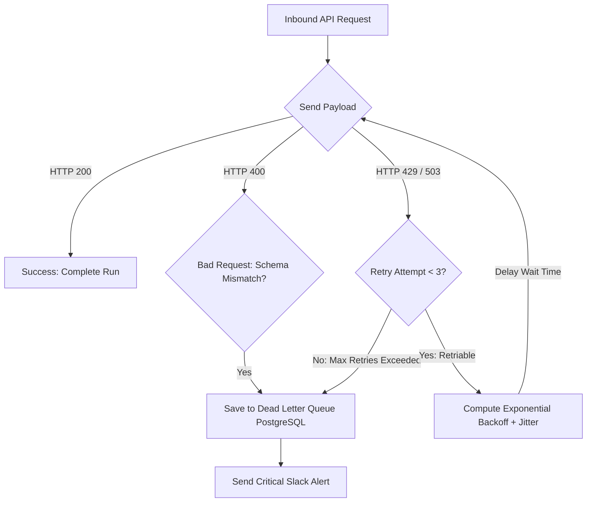

# GTM Architecture - Day 022: API Retry & DLQ Architecture

This document details the retry flow chart and Dead Letter Queue (DLQ) layout configured to prevent data loss in integration pipelines.

---

## 🔄 API Retry & Dead Letter Queue (DLQ) Process

The flowchart below details how inbound transactions are filtered, retried, and logged:



---

## ⚙️ Log Payload Format

When transactions fail permanently, they are logged to a JSON file format inside `integration_failures.log` for automatic alerting:

```json
{
  "timestamp": "2026-07-13 15:37:25",
  "level": "ERROR",
  "details": {
    "endpoint": "/outreach/prospect/add",
    "status_code": 400,
    "error": "Bad Request: Custom field 'job_role' does not exist in schema",
    "payload": {
      "email": "captain@imsgoa.org",
      "job_role": "Deck Officer"
    }
  }
}
```
