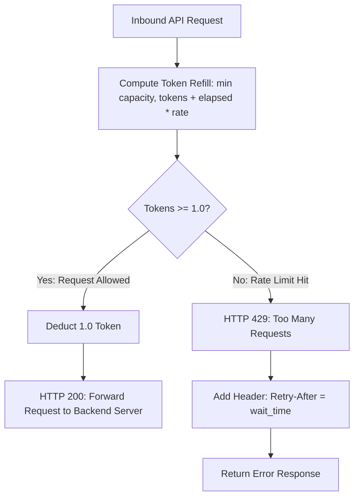

# GTM Architecture - Day 023: API Gateway Rate Limiting

This document details the API Gateway Token Bucket rate limiting architecture.

---

## 🔄 Token Bucket Throttling Architecture

The diagram below details the evaluation flow executed by the gateway rate limiter when an API call is received:



---

## ⚙️ HTTP Response Header Governance

When the rate limiter blocks traffic, the response headers contain throttling directives:

### 1. Successful Request Headers
*   `X-RateLimit-Limit`: `5` (maximum capacity).
*   `X-RateLimit-Remaining`: `3` (tokens remaining).

### 2. Throttled Request Headers (HTTP 429)
*   `Retry-After`: `0.45` (number of seconds to wait before a token refills).
*   `Content-Type`: `application/json`

### 3. Throttled Response Body
```json
{
  "error": "Too Many Requests",
  "message": "API quota exceeded. Please wait before retrying.",
  "retry_after_seconds": 0.45
}
```
