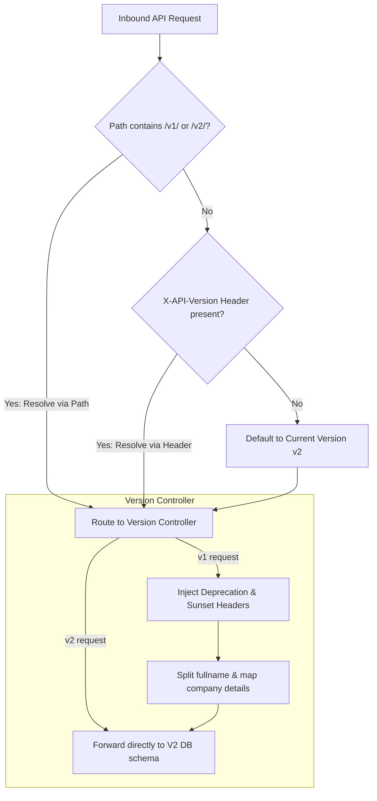

# GTM Architecture - Day 024: Versioned API Router

This document details the GTM API Router architecture, demonstrating version resolution flows and backward-compatible mapping layers.

---

## 🔄 API Version Routing Process

The diagram below details the route and header checks executed when a client request hits the versioned gateway:



---

## ⚙️ HTTP Response Warning Headers (V1 Deprecated)

When clients query deprecated version targets, the router returns response headers alerting engineers of deprecation dates:

### 1. HTTP Response Headers
*   `Deprecation`: `true`
*   `Sunset`: `Mon, 13 Jul 2026 10:00:00 GMT`
*   `Content-Type`: `application/json`

### 2. Normalized V2 Database Record
Regardless of whether a client calls v1 or v2, the database writes are consolidated to the current v2 schema layout:
```json
{
  "first_name": "Vikram",
  "last_name": "Singh",
  "organization": "IMSGOA Maritime College"
}
```
