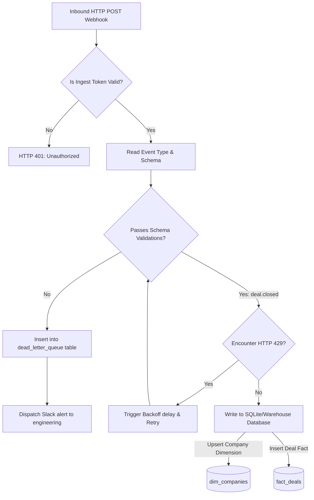

# GTM Architecture - Day 025: Capstone Ingestion Pipeline

This document details the Capstone Ingestion Pipeline data flow architecture.

---

## 🔄 End-to-End Capstone Ingestion Pipeline

The flowchart below maps out the sequence of webhook ingestion, auth checks, validations, backoff retries, and database writes:



---

## ⚙️ Capstone SQL Reporting Schema

Our analytics dashboard executes multi-table SQL joins between the ingested company dimension and deal fact tables to compute account sales:

```sql
SELECT 
    c.company_name,
    c.size_tier,
    SUM(f.amount_usd) AS total_sales,
    SUM(f.license_seats) AS total_seats
FROM fact_deals f
JOIN dim_companies c ON f.company_key = c.company_key
GROUP BY c.company_name, c.size_tier
ORDER BY total_sales DESC;
```
