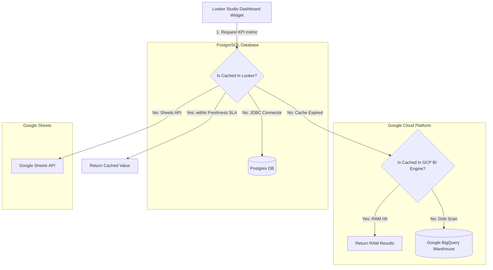

# GTM Architecture - Day 026: Looker Studio Ingestion & Caching

This document details the data source connection architecture and caching layer designed inside the Looker Studio reporting environment.

---

## 🔄 Data Source Connector Ingestion & Caching Flow

The diagram below details the path of queries from Looker dashboard widgets through caching layers to databases:

---

## ⚙️ Looker Studio Connector Security Configuration

To secure PostgreSQL JDBC connections, specify certificate mappings inside the connector credential prompts:

1.  **SSL Validation**: Force connection encryption.
2.  **Key Pair Upload**:
    *   **Server CA Certificate**: Verifies the server identity.
    *   **Client Certificate**: Verifies the Looker client identity.
    *   **Client Private Key**: Authenticates requests.
