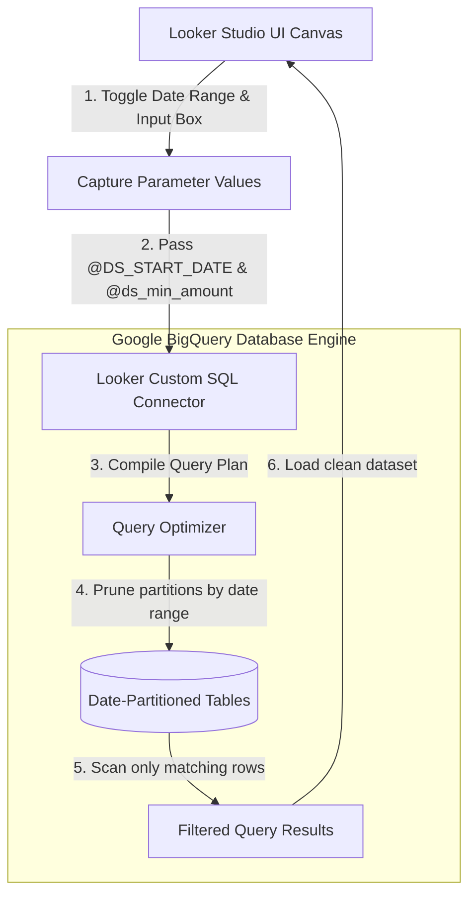

# GTM Architecture - Day 028: Looker Parameters & Filters

This document details the GTM dashboard routing architecture that binds Looker Studio parameter variables directly to database-level partition filters.

---

## 🔄 Parameterized Query Routing Pipeline

The diagram below details the data flow, showing how user-defined inputs filter records at the database engine level before transmission:



---

## ⚙️ Looker Parameter Syntax Mappings

When writing custom SQL in Looker Studio, bind parameters directly inside the `WHERE` filter sequence:

```sql
SELECT 
    deal_id,
    company_name,
    amount_usd,
    close_date
FROM `vivaexams_gtm.fact_deals`
WHERE amount_usd >= @ds_min_amount
  AND close_date BETWEEN PARSE_DATE('%Y%m%d', @DS_START_DATE) 
                       AND PARSE_DATE('%Y%m%d', @DS_END_DATE)
```

This configuration ensures that:
*   `@ds_min_amount` receives the integer value typed inside the Input Box.
*   `@DS_START_DATE` and `@DS_END_DATE` receive the ISO date strings from the Date Range picker.
