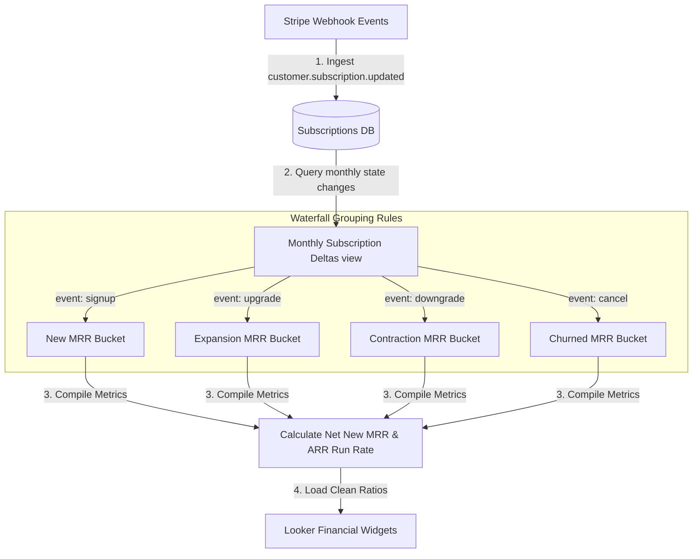

# GTM Architecture - Day 031: Subscription MRR Waterfall

This document details the GTM database pipeline mapping raw billing transactions to monthly financial waterfall reports.

---

## 🔄 MRR Waterfall Generation Flow

The diagram below details the pipeline, showing how Stripe logs are ingested, converted to state deltas, and compiled:



---

## ⚙️ SQL Subscription Event Delta Schema

To compile monthly waterfalls, the database runs window aggregates comparing monthly contract values:

```sql
WITH contract_history AS (
    SELECT 
        company_key,
        DATE_TRUNC(timestamp, MONTH) AS event_month,
        mrr_value AS current_mrr,
        LAG(mrr_value, 1, 0.0) OVER (PARTITION BY company_key ORDER BY timestamp) AS prior_mrr
    FROM subscription_logs
)

SELECT 
    event_month,
    SUM(CASE WHEN prior_mrr = 0.0 AND current_mrr > 0.0 THEN current_mrr END) AS new_mrr,
    SUM(CASE WHEN prior_mrr > 0.0 AND current_mrr > prior_mrr THEN (current_mrr - prior_mrr) END) AS expansion_mrr,
    SUM(CASE WHEN prior_mrr > 0.0 AND current_mrr < prior_mrr AND current_mrr > 0.0 THEN (prior_mrr - current_mrr) END) AS contraction_mrr,
    SUM(CASE WHEN current_mrr = 0.0 AND prior_mrr > 0.0 THEN prior_mrr END) AS churned_mrr
FROM contract_history
GROUP BY 1
ORDER BY event_month ASC;
```
