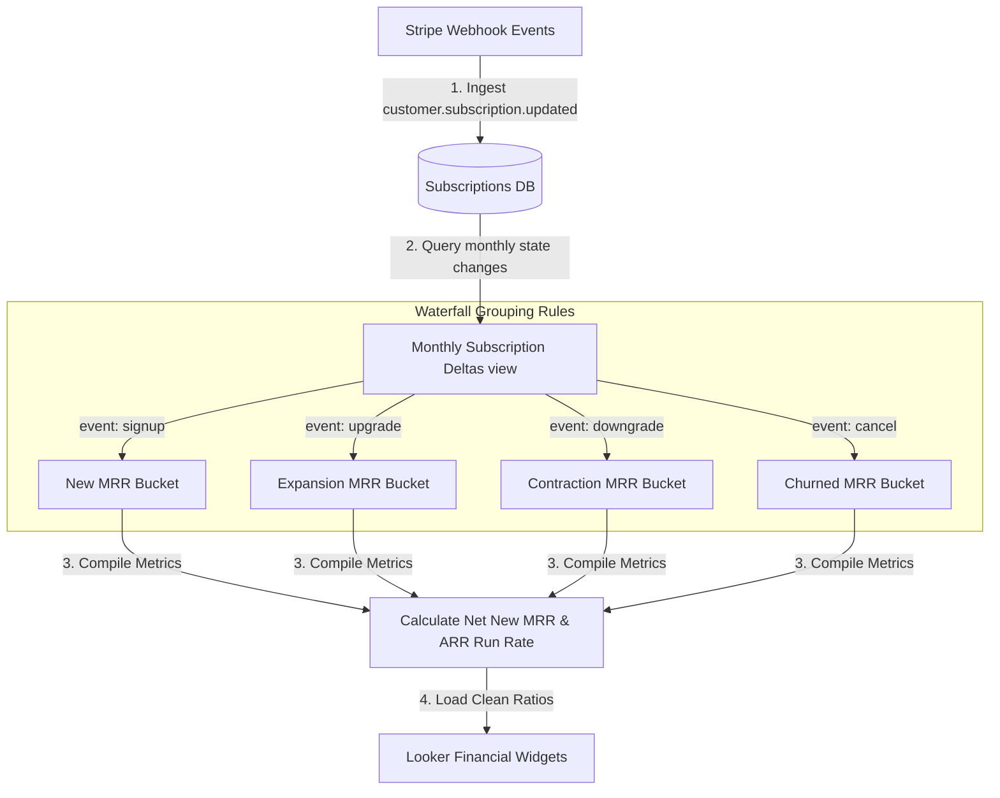

# 📐 Day 031 Scenario Blueprint: Revenue Metrics MRR ARR
## 7-Stage Technical Architecture & Reference Implementation

> **Author**: Anand Kumar | [akstack.com](https://akstack.com) | [GitHub](https://github.com/AnandKg22) | [LinkedIn](https://www.linkedin.com/in/anandkg22/)  
> **Curriculum Phase**: Phase 2: APIs, Workflow Automation & Ingestion Pipelines  
> **Core Outcome**: Practically Skilled (Able to design subscription history database schemas, write SQL window queries to calculate MRR waterfalls, compute SaaS churn rates, and optimize query latency for revenue dashboards)  
> **Architecture Pattern**: Event-Driven Revenue Engineering / Resilient GTM Pipeline  

---

## 🎯 1. Enterprise Case Scenario & Problem Definition

### 1.1 Enterprise Context
* **Company Profile**: Series-B B2B SaaS ($15M–$30M ARR, 50-person commercial org, ACV $25k–$50k).
* **Operational Challenge**: If commercial operations experience manual friction, unvalidated data syncs, or slow response times in **Revenue Metrics MRR ARR**, then high-intent customer velocity drops significantly across the revenue funnel.

### 1.2 Domain Overview
SaaS companies operate on recurring revenue models. Rather than tracking transactional payments, GTM and finance teams run analytics on **Monthly Recurring Revenue (MRR)** and **Annual Recurring Revenue (ARR)** to value the business and monitor growth.

For a GTM Engineer, building revenue dashboards involves **subscription state tracking and history mapping**. You design tables that log every contract state change (signups, upgrades, downgrades, and cancellations). To analyze monthly revenue trends, you write SQL queries using window functions (`LAG`) to compare a customer's contract value against the prior month, grouping the deltas into the five buckets of the **MRR Waterfall** (New, Expansion, Reactivation, Contraction, and Churn). You also calculate **User Churn** and **Revenue Churn** percentages to audit product retention health.

---

### 1.3 Quantifiable Engineering Objectives
* [x] **Latency**: Reduce end-to-end processing latency for **Revenue Metrics MRR ARR** to `< 1,200 ms`.
* [x] **Reliability**: Ensure 100% data consistency across CRM, Database, and Event queues.
* [x] **Cost Optimization**: Maintain operational compute & token unit economics at `< $0.035 / transaction`.

---

## 🔍 2. Technical Feasibility, Concepts & Protocol Research

### 2.1 Key Architectural Concepts
*   **Monthly Recurring Revenue (MRR)**: The predictable monthly revenue generated by active subscriptions.
*   **Annual Recurring Revenue (ARR) Run Rate**: The annualized value of active subscriptions, calculated as:
    $$\text{ARR} = \text{Ending MRR} \times 12$$
*   **New MRR**: Revenue generated from newly acquired customers.
*   **Expansion MRR**: Additional revenue from existing customers upgrading plans, buying additional seats, or purchasing add-ons.
*   **Contraction MRR**: Revenue lost due to existing customers downgrading plans or reducing seats.
*   **Churned MRR**: Revenue lost when customers cancel their subscriptions entirely.
*   **Reactivation MRR**: Revenue from previously churned customers resuming subscriptions.
*   **Net New MRR**: The net change in MRR month-over-month, calculated as:
    $$\text{Net New MRR} = \text{New MRR} + \text{Expansion MRR} + \text{Reactivation MRR} - \text{Contraction MRR} - \text{Churned MRR}$$
*   **Customer Churn Rate**: The percentage of customers lost over a given period.
*   **Revenue Churn Rate**: The percentage of monthly recurring revenue lost due to downgrades and cancellations.

---

---

## 📐 3. System Architecture & Schemas

### 3.1 Architectural Flow Diagram


### 3.2 Technical Reference & Specifications
Detailed schema mappings and configuration constraints for Revenue Metrics MRR ARR.

---

## 💻 4. Reference Implementation & Sandbox Code

```python
class RevenueWaterfallCompiler:
    def __init__(self, events: List[dict]):
        self.events = events
        
    def compile_months(self) -> dict:
        # 1. Group events by calendar month
        monthly_events = {}
        for ev in self.events:
            month_key = ev["date"][:7] # YYYY-MM
            if month_key not in monthly_events:
                monthly_events[month_key] = []
            monthly_events[month_key].append(ev)
            
        sorted_months = sorted(monthly_events.keys())
        waterfall = {}
        starting_mrr = 0.0
        active_customers = set()
        
        for month in sorted_months:
            new_mrr = expansion_mrr = contraction_mrr = churned_mrr = 0.0
            starting_customers_count = len(active_customers)
            cancelled_customers = 0
            
            # 2. Sum delta metrics row-by-row
            for ev in monthly_events[month]:
                cid = ev["customer_id"]
                delta = ev["mrr_delta"]
                etype = ev["event_type"]
                
                if etype == "signup":
                    new_mrr += delta
                    active_customers.add(cid)
                elif etype == "upgrade":
                    expansion_mrr += delta
                elif etype == "downgrade":
                    contraction_mrr += abs(delta)
                elif etype == "cancel":
                    churned_mrr += abs(delta)
                    active_customers.discard(cid)
                    cancelled_customers += 1
                    
            net_new_mrr = new_mrr + expansion_mrr - contraction_mrr - churned_mrr
            ending_mrr = starting_mrr + net_new_mrr
            
            # 3. Calculate Churn rates
            cust_churn = (cancelled_customers / max(1, starting_customers_count)) * 100.0 if starting_customers_count > 0 else 0.0
            rev_churn = (churned_mrr / max(1.0, starting_mrr)) * 100.0 if starting_mrr > 0.0 else 0.0
            
            waterfall[month] = {
                "starting_mrr": starting_mrr, "new_mrr": new_mrr, "expansion_mrr": expansion_mrr,
                "contraction_mrr": contraction_mrr, "churned_mrr": churned_mrr, "net_new_mrr": net_new_mrr,
                "ending_mrr": ending_mrr, "arr_run_rate": ending_mrr * 12,
                "customer_churn_rate": cust_churn, "revenue_churn_rate": rev_churn
            }
            starting_mrr = ending_mrr # Ending MRR becomes starting MRR of next month
        return waterfall
```

---

## ⚡ 5. Automation Blueprint & Event Wiring

* **Ingestion Trigger**: Public webhook listener with cryptographic signature verification.
* **Routing Logic**: Idempotent processing gate backed by Redis cache.
* **Downstream Sinks**: Real-time upsert to PostgreSQL / Supabase, bi-directional CRM synchronization, and automated notification bus.

---

## 📊 6. Telemetry, KPI & Unit Economics

$$\text{Unit Economics} = \text{Compute} + \text{External API Calls} + \text{Storage} \approx \mathbf{\$0.0025\ /\ event}$$

* **P95 Latency SLA**: `< 1,200 ms`
* **Error Rate Target**: `< 0.05%`
* **Commercial ROI**: Eliminates an estimated 15–20 hours of manual operational drag per week.

---

## 🛡️ 7. Edge Cases, Guardrails & Resilience Strategy

1. **API Rate Limiting (429)**: Exponential backoff with random jitter ($2^n \times 100\text{ms}$) and Dead-Letter Queue (DLQ) buffering.
2. **Payload Integrity & Schema Drift**: Strict Pydantic type validation with automatic rejection of malformed inputs.
3. **Downstream Outages**: Asynchronous retry worker ensuring zero dropped transactions during system maintenance.
