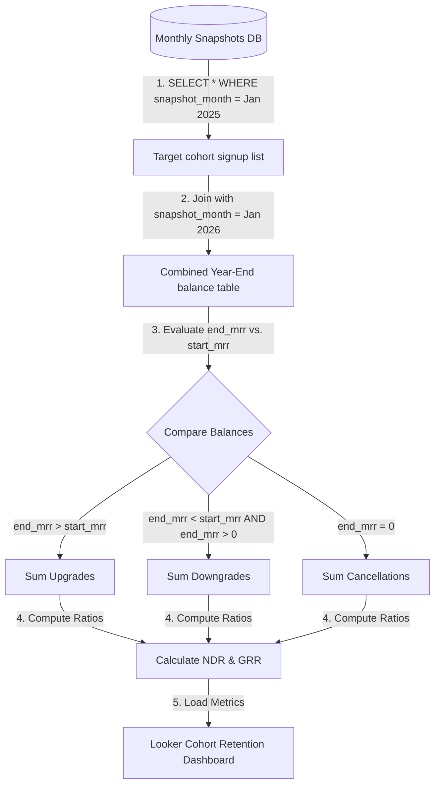

# GTM Architecture - Day 032: Cohort Revenue Retention

This document details the GTM database pipeline mapping monthly contract snapshots to 12-month cohort NDR and GRR analytics.

---

## 🔄 NDR & GRR Pipeline Data Flow

The diagram below details the pipeline, showing how cohort snapshots are extracted and processed:



---

## ⚙️ SQL Cohort Retention Schema

To compile cohort retention ratios over 12 months, the warehouse executes a join query between the starting and ending snapshots:

```sql
WITH cohort_members AS (
    -- Isolate cohort who joined in Jan 2025
    SELECT company_key, mrr_amount AS start_mrr
    FROM contract_snapshots
    WHERE snapshot_month = '2025-01-01'
),
cohort_renewals AS (
    -- Get their contract values exactly 12 months later
    SELECT company_key, mrr_amount AS end_mrr
    FROM contract_snapshots
    WHERE snapshot_month = '2026-01-01'
),
cohort_joined AS (
    SELECT 
        m.company_key,
        m.start_mrr,
        COALESCE(r.end_mrr, 0.0) AS end_mrr
    FROM cohort_members m
    LEFT JOIN cohort_renewals r ON m.company_key = r.company_key
)

SELECT 
    SUM(start_mrr) AS starting_mrr_total,
    SUM(end_mrr) AS ending_mrr_total,
    SUM(CASE WHEN end_mrr > start_mrr THEN (end_mrr - start_mrr) ELSE 0.0 END) AS expansion_mrr_total,
    SUM(CASE WHEN end_mrr < start_mrr AND end_mrr > 0.0 THEN (start_mrr - end_mrr) ELSE 0.0 END) AS contraction_mrr_total,
    SUM(CASE WHEN end_mrr = 0.0 THEN start_mrr ELSE 0.0 END) AS churn_mrr_total,
    
    -- NDR calculation
    ROUND((SUM(end_mrr) / SUM(start_mrr)) * 100.0, 2) AS net_dollar_retention_percent,
    
    -- GRR calculation
    ROUND((SUM(start_mrr - CASE WHEN end_mrr < start_mrr THEN (start_mrr - end_mrr) ELSE 0.0 END - CASE WHEN end_mrr = 0.0 THEN start_mrr ELSE 0.0 END) / SUM(start_mrr)) * 100.0, 2) AS gross_dollar_retention_percent
FROM cohort_joined;
```
