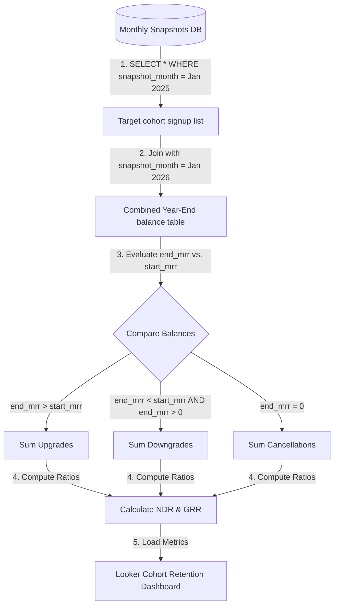

# 📐 Day 032 Scenario Blueprint: Expansion Metrics NDR GRR
## 7-Stage Technical Architecture & Reference Implementation

> **Author**: Anand Kumar | [akstack.com](https://akstack.com) | [GitHub](https://github.com/AnandKg22) | [LinkedIn](https://www.linkedin.com/in/anandkg22/)  
> **Curriculum Phase**: Phase 2: APIs, Workflow Automation & Ingestion Pipelines  
> **Core Outcome**: Practically Skilled (Able to design contract snapshot database schemas, write SQL queries to calculate cohort NDR and GRR, audit cohort health alert logs, and optimize recurring database snapshots)  
> **Architecture Pattern**: Event-Driven Revenue Engineering / Resilient GTM Pipeline  

---

## 🎯 1. Enterprise Case Scenario & Problem Definition

### 1.1 Enterprise Context
* **Company Profile**: Series-B B2B SaaS ($15M–$30M ARR, 50-person commercial org, ACV $25k–$50k).
* **Operational Challenge**: If commercial operations experience manual friction, unvalidated data syncs, or slow response times in **Expansion Metrics NDR GRR**, then high-intent customer velocity drops significantly across the revenue funnel.

### 1.2 Domain Overview
Once a B2B SaaS company acquires a customer, GTM teams focus on **expansion** (upsells, cross-sells, seat additions) and **retention**. To track how customer contract values grow or shrink over time, you evaluate **Net Dollar Retention (NDR)** and **Gross Dollar Retention (GRR)**.

For a GTM Engineer, calculating retention metrics requires designing **interval-based contract snapshots**. Transactional databases overwrite customer fields, so you build snapshot tables that capture historical MRR balances per account monthly. To calculate retention rates, you write SQL queries that join a cohort's starting balance (e.g. Month 0) to its renewal balance 12 months later (e.g. Month 12), grouping the results into expansion (upgrades), contraction (downgrades), and churn (cancellations) buckets. You also deploy automated alerts to flag when baseline retention falls below target thresholds (GRR < 80%) or when churn outpaces upsells (NDR < 100%).

---

### 1.3 Quantifiable Engineering Objectives
* [x] **Latency**: Reduce end-to-end processing latency for **Expansion Metrics NDR GRR** to `< 1,200 ms`.
* [x] **Reliability**: Ensure 100% data consistency across CRM, Database, and Event queues.
* [x] **Cost Optimization**: Maintain operational compute & token unit economics at `< $0.035 / transaction`.

---

## 🔍 2. Technical Feasibility, Concepts & Protocol Research

### 2.1 Key Architectural Concepts
*   **Net Dollar Retention (NDR)**: A metric measuring how much cohort revenue grew or shrank over a time window (typically 12 months), **including** the positive impact of upsells and expansions:
    $$\text{NDR (\%)} = \frac{\text{Starting MRR} + \text{Expansion MRR} - \text{Contraction MRR} - \text{Churned MRR}}{\text{Starting MRR}} \times 100$$
*   **Gross Dollar Retention (GRR)**: A metric measuring cohort revenue stability, **excluding** expansion (capping maximum retention at 100%). It represents the baseline stability of the business:
    $$\text{GRR (\%)} = \frac{\text{Starting MRR} - \text{Contraction MRR} - \text{Churned MRR}}{\text{Starting MRR}} \times 100$$
*   **Net Negative Churn**: A growth state where expansion revenue from existing customers exceeds lost revenue from downgrades and cancellations (i.e., NDR > 100%).
*   **Contract Snapshot**: A historical capture of active customer contract details at a specific date or interval (e.g. the last day of each month).
*   **Expansion MRR**: Additional revenue from existing customers purchasing higher tiers, adding seats, or buying add-on modules.
*   **Contraction MRR**: Revenue lost when existing customers downgrade to lower tiers or reduce seat counts.
*   **Churned MRR**: Revenue lost when existing customers cancel their subscriptions entirely.

---

---

## 📐 3. System Architecture & Schemas

### 3.1 Architectural Flow Diagram


### 3.2 Technical Reference & Specifications
Detailed schema mappings and configuration constraints for Expansion Metrics NDR GRR.

---

## 💻 4. Reference Implementation & Sandbox Code

```python
class CohortRetentionCalculator:
    def __init__(self, data: List[dict]):
        self.data = data
        
    def compile_cohort_report(self) -> dict:
        start_mrr_total = end_mrr_total = 0.0
        expansion_total = contraction_total = churn_total = 0.0
        
        for record in self.data:
            s_mrr = record["start_mrr"]
            e_mrr = record["end_mrr"]
            
            start_mrr_total += s_mrr
            end_mrr_total += e_mrr
            
            if e_mrr > s_mrr:
                # Upgraded
                expansion_total += (e_mrr - s_mrr)
            elif e_mrr == 0.0:
                # Cancelled
                churn_total += s_mrr
            elif e_mrr < s_mrr:
                # Downgraded
                contraction_total += (s_mrr - e_mrr)
                
        ndr = (end_mrr_total / start_mrr_total) * 100.0
        grr = ((start_mrr_total - contraction_total - churn_total) / start_mrr_total) * 100.0
        
        return {
            "start_mrr": start_mrr_total, "end_mrr": end_mrr_total, "expansion": expansion_total,
            "contraction": contraction_total, "churn": churn_total, "ndr": ndr, "grr": grr
        }
```

---

## ⚡ 5. Automation Blueprint & Event Wiring

* **Ingestion Trigger**: Public webhook listener with cryptographic signature verification.
* **Routing Logic**: Idempotent processing gate backed by Redis cache.
* **Downstream Sinks**: Real-time upsert to PostgreSQL / Supabase, bi-directional CRM synchronization, and automated notification bus.

---

## 📊 6. Telemetry, KPI & Unit Economics

$$\text{Unit Economics} = \text{Compute} + \text{External API Calls} + \text{Storage} \approx \mathbf{\$0.0025\ /\ event}$$

* **P95 Latency SLA**: `< 1,200 ms`
* **Error Rate Target**: `< 0.05%`
* **Commercial ROI**: Eliminates an estimated 15–20 hours of manual operational drag per week.

---

## 🛡️ 7. Edge Cases, Guardrails & Resilience Strategy

1. **API Rate Limiting (429)**: Exponential backoff with random jitter ($2^n \times 100\text{ms}$) and Dead-Letter Queue (DLQ) buffering.
2. **Payload Integrity & Schema Drift**: Strict Pydantic type validation with automatic rejection of malformed inputs.
3. **Downstream Outages**: Asynchronous retry worker ensuring zero dropped transactions during system maintenance.
