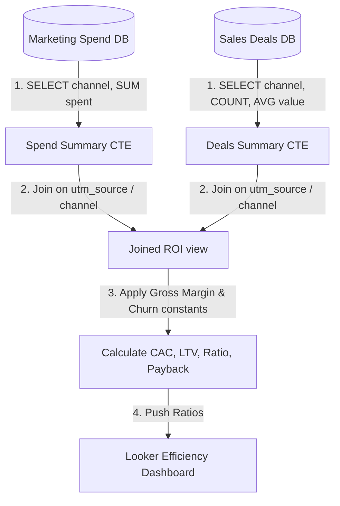

# GTM Architecture - Day 033: LTV:CAC Ingestion Pipeline

This document details the GTM database pipeline mapping ad network campaign costs to customer sales databases.

---

## 🔄 LTV:CAC Reporting Pipeline

The diagram below details the data flow, showing how costs and contract tables are joined to compute efficiency ratios:



---

## ⚙️ SQL Channel ROI Summary Schema

To compile ROI reports in Looker Studio, the warehouse executes a join query between the campaign spend and deal summary tables:

```sql
WITH marketing_summary AS (
    SELECT 
        utm_source AS channel,
        SUM(amount_spent) AS total_spend
    FROM ad_clicks
    GROUP BY 1
),
deals_summary AS (
    SELECT 
        lead_source AS channel,
        COUNT(deal_id) AS acquisitions_count,
        AVG(annual_contract_value) AS avg_acv
    FROM fact_deals
    WHERE deal_stage = 'Won'
    GROUP BY 1
)

SELECT 
    m.channel,
    m.total_spend,
    d.acquisitions_count,
    
    -- Blended CAC
    ROUND(m.total_spend / d.acquisitions_count, 2) AS blended_cac,
    
    -- ACV
    ROUND(d.avg_acv, 2) AS average_acv,
    
    -- Gross Margin LTV (80% margin, 12% churn)
    ROUND((d.avg_acv * 0.80) / 0.12, 2) AS gross_margin_ltv,
    
    -- LTV:CAC
    ROUND(((d.avg_acv * 0.80) / 0.12) / (m.total_spend / d.acquisitions_count), 2) AS ltv_cac_ratio
FROM marketing_summary m
JOIN deals_summary d ON m.channel = d.channel;
```
