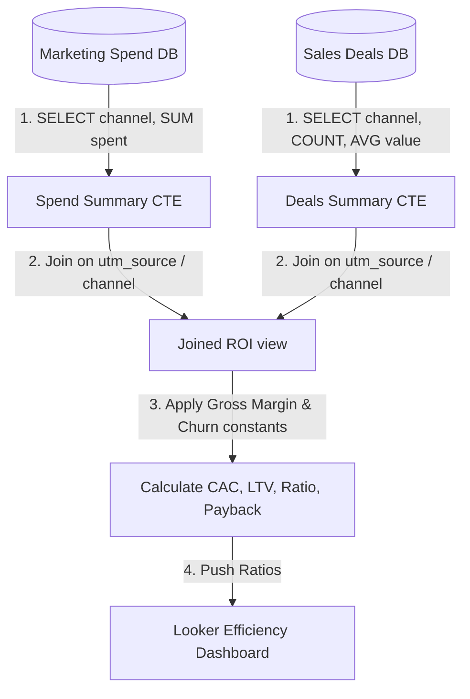

# 📐 Day 033 Scenario Blueprint: Efficiency Metrics LTV CAC
## 7-Stage Technical Architecture & Reference Implementation

> **Author**: Anand Kumar | [akstack.com](https://akstack.com) | [GitHub](https://github.com/AnandKg22) | [LinkedIn](https://www.linkedin.com/in/anandkg22/)  
> **Curriculum Phase**: Phase 2: APIs, Workflow Automation & Ingestion Pipelines  
> **Core Outcome**: Practically Skilled (Able to design marketing spend database tables, write SQL queries to calculate channel CAC and LTV, audit GTM payback periods, and optimize ROI queries for high-volume logs)  
> **Architecture Pattern**: Event-Driven Revenue Engineering / Resilient GTM Pipeline  

---

## 🎯 1. Enterprise Case Scenario & Problem Definition

### 1.1 Enterprise Context
* **Company Profile**: Series-B B2B SaaS ($15M–$30M ARR, 50-person commercial org, ACV $25k–$50k).
* **Operational Challenge**: If commercial operations experience manual friction, unvalidated data syncs, or slow response times in **Efficiency Metrics LTV CAC**, then high-intent customer velocity drops significantly across the revenue funnel.

### 1.2 Domain Overview
Acquiring customers is meaningless if the marketing cost outpaces the revenue they generate. In B2B SaaS, operations teams track GTM efficiency metrics to ensure sales and marketing channels are profitable. The two primary metrics used are **Customer Acquisition Cost (CAC)** and **Customer Lifetime Value (LTV)**.

For a GTM Engineer, building efficiency reporting pipelines requires **attribution mapping**. You design marketing spend tables that track campaign costs by channel and date, and join them to sales contract tables using UTM codes or campaign keys. You write SQL queries that aggregate costs, count acquired accounts, apply Gross Margin and Churn constants, and calculate the **LTV:CAC Ratio** and **CAC Payback Period (Months)**. These metrics help identify profitable acquisition channels and flag underperforming campaigns.

---

### 1.3 Quantifiable Engineering Objectives
* [x] **Latency**: Reduce end-to-end processing latency for **Efficiency Metrics LTV CAC** to `< 1,200 ms`.
* [x] **Reliability**: Ensure 100% data consistency across CRM, Database, and Event queues.
* [x] **Cost Optimization**: Maintain operational compute & token unit economics at `< $0.035 / transaction`.

---

## 🔍 2. Technical Feasibility, Concepts & Protocol Research

### 2.1 Key Architectural Concepts
*   **Customer Acquisition Cost (CAC)**: The average cost to acquire a single customer:
    $$\text{CAC} = \frac{\text{Total Sales \& Marketing Expenses}}{\text{Number of Customers Acquired}}$$
*   **Customer Lifetime Value (LTV)**: The average gross margin revenue a customer generates before churning:
    $$\text{LTV} = \frac{\text{Average Revenue Per User (ARPU)} \times \text{Gross Margin (\%) }}{\text{Monthly Churn Rate}}$$
*   **LTV:CAC Ratio**: A metric measuring the return on customer acquisition investments. B2B SaaS benchmarks:
    *   *Unprofitable*: $< 3.0\text{x}$ (spending too much to acquire low-value accounts).
    *   *Healthy Target*: $3.0\text{x} - 5.0\text{x}$ (healthy B2B unit economics).
    *   *Highly Efficient*: $> 5.0\text{x}$ (efficient, but suggests under-investing in marketing).
*   **CAC Payback Period (Months)**: The number of months required for a customer to generate enough gross margin revenue to cover their CAC:
    $$\text{Payback Period (Months)} = \frac{\text{CAC}}{\text{Average Monthly Value} \times \text{Gross Margin (\%) }}$$
*   **Gross Margin**: The percentage of revenue retained after subtracting cost of goods sold (COGS), such as hosting and support overhead:
    $$\text{Gross Margin (\%)} = \frac{\text{Revenue} - \text{COGS}}{\text{Revenue}} \times 100$$
*   **Blended CAC**: Total sales and marketing spend divided by the total number of customers acquired across all channels.
*   **Channel-Specific CAC**: Spend and acquisitions grouped by a specific channel (e.g. Google Ads) to evaluate channel ROI.

---

---

## 📐 3. System Architecture & Schemas

### 3.1 Architectural Flow Diagram


### 3.2 Technical Reference & Specifications
Detailed schema mappings and configuration constraints for Efficiency Metrics LTV CAC.

---

## 💻 4. Reference Implementation & Sandbox Code

```python
class GTMEfficiencyCalculator:
    def __init__(self, spend: List[dict], accounts: List[dict]):
        self.spend = spend
        self.accounts = accounts
        
    def compile_channels_report(self) -> dict:
        gross_margin = 0.80
        annual_churn_rate = 0.12
        
        # 1. Aggregate Spend by channel
        spend_totals = {s["channel"]: s["amount_spent"] for s in self.spend}
            
        # 2. Group Won values by channel
        channel_data = {}
        for acct in self.accounts:
            ch = acct["channel"]
            val = acct["annual_value"]
            if ch not in channel_data:
                channel_data[ch] = {"count": 0, "total_value": 0.0}
            channel_data[ch]["count"] += 1
            channel_data[ch]["total_value"] += val
            
        # 3. Calculate metrics per channel
        report = {}
        for ch, data in channel_data.items():
            count = data["count"]
            total_val = data["total_value"]
            spend_val = spend_totals.get(ch, 0.0)
            
            avg_acv = total_val / count
            avg_mrr = avg_acv / 12.0
            
            cac = spend_val / count
            ltv = (avg_acv * gross_margin) / annual_churn_rate
            ltv_cac_ratio = ltv / max(1.0, cac)
            payback_months = cac / (avg_mrr * gross_margin)
            
            report[ch] = {
                "spend": spend_val, "acquisitions": count, "cac": cac,
                "acv": avg_acv, "ltv": ltv, "ratio": ltv_cac_ratio, "payback": payback_months
            }
        return report
```

---

## ⚡ 5. Automation Blueprint & Event Wiring

* **Ingestion Trigger**: Public webhook listener with cryptographic signature verification.
* **Routing Logic**: Idempotent processing gate backed by Redis cache.
* **Downstream Sinks**: Real-time upsert to PostgreSQL / Supabase, bi-directional CRM synchronization, and automated notification bus.

---

## 📊 6. Telemetry, KPI & Unit Economics

$$\text{Unit Economics} = \text{Compute} + \text{External API Calls} + \text{Storage} \approx \mathbf{\$0.0025\ /\ event}$$

* **P95 Latency SLA**: `< 1,200 ms`
* **Error Rate Target**: `< 0.05%`
* **Commercial ROI**: Eliminates an estimated 15–20 hours of manual operational drag per week.

---

## 🛡️ 7. Edge Cases, Guardrails & Resilience Strategy

1. **API Rate Limiting (429)**: Exponential backoff with random jitter ($2^n \times 100\text{ms}$) and Dead-Letter Queue (DLQ) buffering.
2. **Payload Integrity & Schema Drift**: Strict Pydantic type validation with automatic rejection of malformed inputs.
3. **Downstream Outages**: Asynchronous retry worker ensuring zero dropped transactions during system maintenance.
