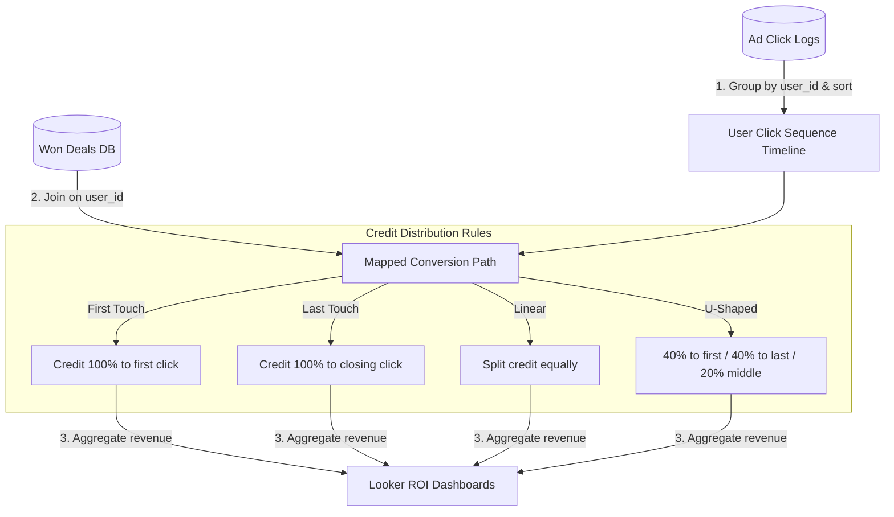

# GTM Architecture - Day 035: Multi-Touch Attribution

This document details the GTM database pipeline mapping user click histories and won conversions to multi-touch attribution reports.

---

## 🔄 Attribution Processing Data Flow

The diagram below details the pipeline, showing how click logs are sorted and credited:



---

## ⚙️ SQL Sequence Attribution Schema

To calculate weights in BigQuery, the database runs window aggregates across the click logs:

```sql
WITH user_touchpoints AS (
    SELECT 
        c.user_id,
        c.utm_source AS channel,
        ROW_NUMBER() OVER (PARTITION BY c.user_id ORDER BY c.timestamp ASC) AS touch_index,
        COUNT(1) OVER (PARTITION BY c.user_id) AS total_touches,
        v.revenue
    FROM user_clicks c
    JOIN won_conversions v ON c.user_id = v.user_id
)

SELECT 
    channel,
    
    -- First Touch Credit
    SUM(CASE WHEN touch_index = 1 THEN revenue ELSE 0.0 END) AS first_touch_revenue,
    
    -- Last Touch Credit
    SUM(CASE WHEN touch_index = total_touches THEN revenue ELSE 0.0 END) AS last_touch_revenue,
    
    -- Linear Credit
    SUM(revenue / total_touches) AS linear_revenue,
    
    -- U-Shaped Credit
    SUM(
        CASE 
            WHEN total_touches = 1 THEN revenue
            WHEN total_touches = 2 AND touch_index = 1 THEN revenue * 0.50
            WHEN total_touches = 2 AND touch_index = 2 THEN revenue * 0.50
            WHEN total_touches >= 3 AND touch_index = 1 THEN revenue * 0.40
            WHEN total_touches >= 3 AND touch_index = total_touches THEN revenue * 0.40
            ELSE revenue * (0.20 / (total_touches - 2))
        END
    ) AS u_shaped_revenue
FROM user_touchpoints
GROUP BY 1;
```
