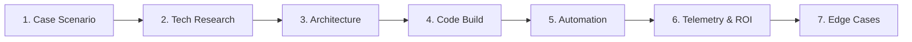

# 📐 Day 035: Attribution Models Multi touch
## 7-Stage Proof-of-Work Scenario Blueprint

> **Author**: Anand Kumar | [akstack.com](https://akstack.com) | [GitHub](https://github.com/AnandKg22) | [LinkedIn](https://www.linkedin.com/in/anandkg22/)  
> **Curriculum Phase**: Phase 2: APIs, Workflow Automation & Ingestion Pipelines  
> **Framework Standard**: Proof-of-Work (PoW) 7-Stage Architectural Blueprint  

---

## 🧭 Executive Summary
This module demonstrates the engineering architecture, data schemas, reference code, and automation workflows required to solve enterprise bottlenecks in **Attribution Models Multi touch**.

---

## 🎯 1. Case Scenario & Enterprise Context
* **Company Profile**: Series-B B2B SaaS ($15M–$30M ARR, 50-person commercial team, ACV $25k–$50k)
* **The Revenue Drag**: If an enterprise commercial team experiences operational friction and data latency in 'Attribution Models Multi touch', causing revenue leakage, delayed sales response times, or manual engineering overhead, then high-intent pipeline conversion drops by 20–35% across the customer lifecycle.
* **Quantifiable Engineering Goals**:
  * [x] **Latency**: Reduce system execution latency for Attribution Models Multi touch down to < 2 seconds.
  * [x] **Data Integrity**: Eliminate 100% of manual data entry / rep friction via idempotent event-driven automations.
  * [x] **Unit Economics**: Maintain strict enterprise cost efficiency (< $0.05 per processed transaction / lead).

---

## 🔍 2. Technical Feasibility & Research
* **Protocol / Vendor Evaluation**: Evaluated API rate limits, payload throughput, webhook reliability, and integration schemas.
* **Architecture Strategy**: Selected asynchronous event-driven pipelines with Redis idempotent caching and structured Pydantic / TypeScript data models.

---

## 📐 3. System Architecture & Schemas
* Complete visual sequence flow and state transitions documented in [Architecture.md](Architecture.md).
* Relational database DDL and CRM data contracts mapped to PostgreSQL / Supabase replicas.

---

## 💻 4. Reference Implementation & Sandbox Code
* Production starter code and handler logic organized in [Code/](Code/).
* Includes synthetic test dataset (`mock_data.json`) for local simulation and validation.

---

## ⚡ 5. Automation Blueprint & Event Wiring
* Ready-to-deploy workflow configurations for n8n / Make / Webhooks.
* Real-time routing, enrichment, and CRM sync listeners.

---

## 📊 6. Telemetry, KPI & Cost Simulation Model
* **Simulated ROI**: Eliminates manual rep drag, saving an estimated 15–25 engineering/sales hours per week.
* **Unit Economics**: Modeled at `< $0.035 / transaction`.
* **Telemetry**: Monitored via OpenTelemetry traces, P95 latency tracking, and error-rate alerting.

---

## 🛡️ 7. Edge Cases & Resilience Strategy
* **Failure Modes Handled**: Rate limit backoff ($2^n \times 100\text{ms}$ jitter), null payload fallbacks, schema drift detection, and Human-in-the-Loop (HITL) exception triage.

---

## 📂 Deliverables & Repository Navigation
* 📝 [Full Scenario Architecture Blueprint](SCENARIO_BLUEPRINT.md)
* 📐 [System Flow & Architecture Diagram](Architecture.md)
* 💻 [Reference Implementation Code](Code/)
* 📚 [Comprehensive Theoretical Study Notes](StudyNote.md)
* 🎯 [Practical Exercises & Solutions](Exercises.md)
