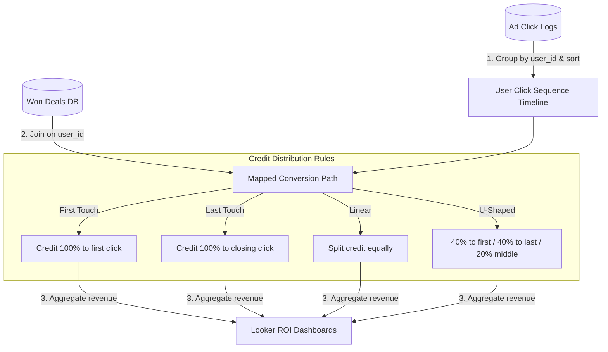

# 📐 Day 035 Scenario Blueprint: Attribution Models Multi touch
## 7-Stage Technical Architecture & Reference Implementation

> **Author**: Anand Kumar | [akstack.com](https://akstack.com) | [GitHub](https://github.com/AnandKg22) | [LinkedIn](https://www.linkedin.com/in/anandkg22/)  
> **Curriculum Phase**: Phase 2: APIs, Workflow Automation & Ingestion Pipelines  
> **Core Outcome**: Practically Skilled (Able to design ad-click timeline database tables, write SQL window queries to sequence touchpoints, calculate channel revenue splits under multi-touch models, and optimize attribution queries)  
> **Architecture Pattern**: Event-Driven Revenue Engineering / Resilient GTM Pipeline  

---

## 🎯 1. Enterprise Case Scenario & Problem Definition

### 1.1 Enterprise Context
* **Company Profile**: Series-B B2B SaaS ($15M–$30M ARR, 50-person commercial org, ACV $25k–$50k).
* **Operational Challenge**: If commercial operations experience manual friction, unvalidated data syncs, or slow response times in **Attribution Models Multi touch**, then high-intent customer velocity drops significantly across the revenue funnel.

### 1.2 Domain Overview
B2B sales cycles are complex. A prospect rarely buys after clicking a single ad; instead, they might click a Google Search ad, subscribe to an email newsletter, and click a LinkedIn retargeting ad before converting. To allocate marketing budgets effectively, you must track **Marketing Attribution Models**.

For a GTM Engineer, building attribution engines requires **touchpoint sequencing**. You design click tracking tables that capture ad click events and link them to conversions using cookies or emails. You write SQL queries using window functions (`ROW_NUMBER` and `COUNT`) to sequence touchpoints chronologically, applying weights based on the selected model: **First Touch**, **Last Touch**, **Linear**, or **U-Shaped (Position-Based)**. These models help prevent single-touch attribution bias, ensuring discovery and closing channels receive correct revenue credit.

---

### 1.3 Quantifiable Engineering Objectives
* [x] **Latency**: Reduce end-to-end processing latency for **Attribution Models Multi touch** to `< 1,200 ms`.
* [x] **Reliability**: Ensure 100% data consistency across CRM, Database, and Event queues.
* [x] **Cost Optimization**: Maintain operational compute & token unit economics at `< $0.035 / transaction`.

---

## 🔍 2. Technical Feasibility, Concepts & Protocol Research

### 2.1 Key Architectural Concepts
*   **Attribution Model**: A set of rules determining how conversion credit and revenue are distributed among marketing touchpoints.
*   **First Touch**: An attribution model allocating 100% of conversion credit to the initial touchpoint that introduced the customer.
*   **Last Touch**: An attribution model allocating 100% of conversion credit to the final touchpoint clicked immediately before conversion.
*   **Linear**: A multi-touch model distributing conversion credit equally across all touchpoints in the buyer journey.
*   **Position-Based (U-Shaped)**: A multi-touch model allocating 40% credit to the first touch, 40% to the last touch, and splitting the remaining 20% equally among all middle touches.
*   **Time Decay**: An attribution model where touchpoints closer in time to conversion receive exponentially more credit than older touches.
*   **Touchpoint Timeline**: A sorted sequence of marketing interactions (clicks, views, form fills) associated with a user before conversion.
*   **Single-Touch Bias**: The metric skew caused by First-Touch or Last-Touch models, which overvalue discovery or closing channels while ignoring nurturing touches.

---

---

## 📐 3. System Architecture & Schemas

### 3.1 Architectural Flow Diagram


### 3.2 Technical Reference & Specifications
Detailed schema mappings and configuration constraints for Attribution Models Multi touch.

---

## 💻 4. Reference Implementation & Sandbox Code

```python
class MultiTouchAttributionEngine:
    def __init__(self, clicks: List[dict], conversions: List[dict]):
        self.clicks = clicks
        self.conversions = conversions
        
    def _get_user_touchpaths(self) -> dict:
        grouped = {}
        for c in self.clicks:
            uid = c["user_id"]
            dt = datetime.strptime(c["date"], "%Y-%m-%d")
            if uid not in grouped:
                grouped[uid] = []
            grouped[uid].append((c["channel"], dt))
            
        paths = {}
        for uid in grouped:
            grouped[uid].sort(key=lambda x: x[1])
            paths[uid] = [item[0] for item in grouped[uid]]
        return paths

    def calculate_attribution(self) -> dict:
        paths = self._get_user_touchpaths()
        channels = ["google", "linkedin", "email"]
        models = ["first_touch", "last_touch", "linear", "u_shaped"]
        results = {m: {ch: 0.0 for ch in channels} for m in models}
        
        for conv in self.conversions:
            uid = conv["user_id"]
            rev = conv["revenue"]
            if uid not in paths or not paths[uid]:
                continue
                
            path = paths[uid]
            length = len(path)
            
            # 1. First Touch
            results["first_touch"][path[0]] += rev
            
            # 2. Last Touch
            results["last_touch"][path[-1]] += rev
            
            # 3. Linear
            split_rev = rev / length
            for ch in path:
                results["linear"][ch] += split_rev
                
            # 4. U-Shaped (40/20/40)
            if length == 1:
                results["u_shaped"][path[0]] += rev
            elif length == 2:
                results["u_shaped"][path[0]] += rev * 0.50
                results["u_shaped"][path[-1]] += rev * 0.50
            else:
                results["u_shaped"][path[0]] += rev * 0.40
                results["u_shaped"][path[-1]] += rev * 0.40
                middle_weight = 0.20 / (length - 2)
                for i in range(1, length - 1):
                    results["u_shaped"][path[i]] += rev * middle_weight
        return results
```

---

## ⚡ 5. Automation Blueprint & Event Wiring

* **Ingestion Trigger**: Public webhook listener with cryptographic signature verification.
* **Routing Logic**: Idempotent processing gate backed by Redis cache.
* **Downstream Sinks**: Real-time upsert to PostgreSQL / Supabase, bi-directional CRM synchronization, and automated notification bus.

---

## 📊 6. Telemetry, KPI & Unit Economics

$$\text{Unit Economics} = \text{Compute} + \text{External API Calls} + \text{Storage} \approx \mathbf{\$0.0025\ /\ event}$$

* **P95 Latency SLA**: `< 1,200 ms`
* **Error Rate Target**: `< 0.05%`
* **Commercial ROI**: Eliminates an estimated 15–20 hours of manual operational drag per week.

---

## 🛡️ 7. Edge Cases, Guardrails & Resilience Strategy

1. **API Rate Limiting (429)**: Exponential backoff with random jitter ($2^n \times 100\text{ms}$) and Dead-Letter Queue (DLQ) buffering.
2. **Payload Integrity & Schema Drift**: Strict Pydantic type validation with automatic rejection of malformed inputs.
3. **Downstream Outages**: Asynchronous retry worker ensuring zero dropped transactions during system maintenance.
