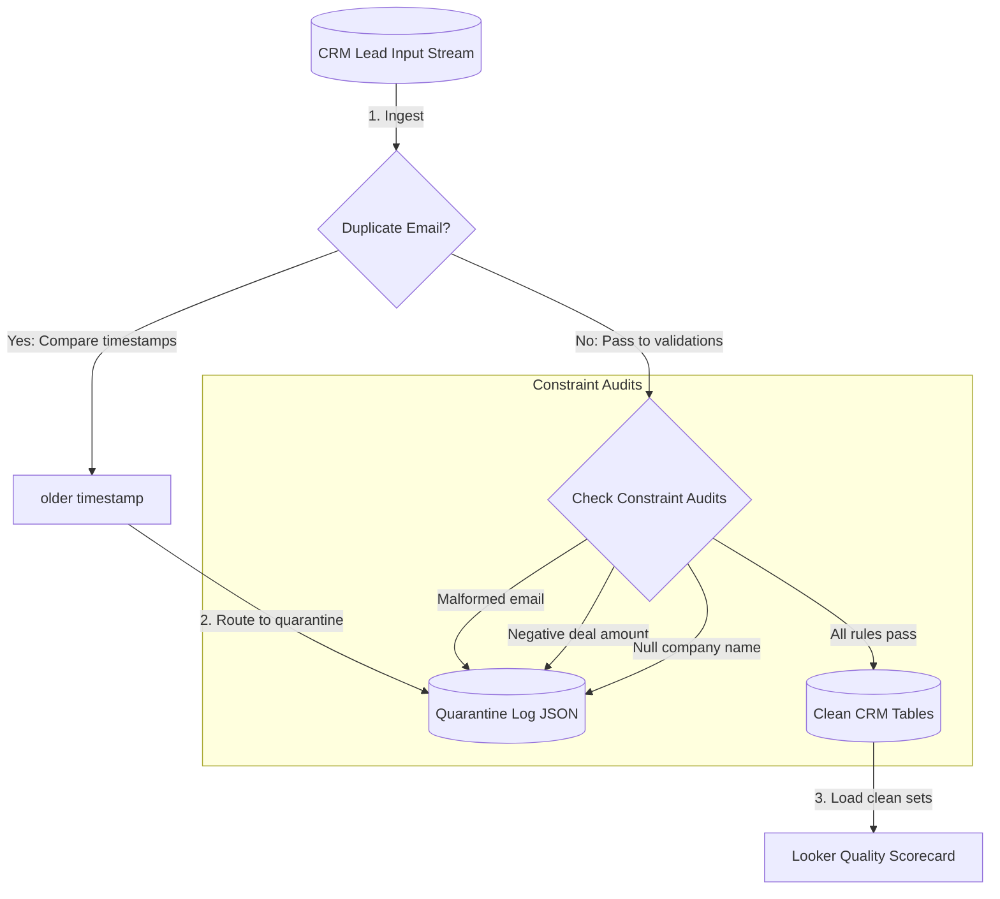

# GTM Architecture - Day 036: Data Quality & Auditing

This document details the GTM database pipeline mapping dirty CRM leads through validation checks and duplicates filters.

---

## 🔄 Data Auditing and Quarantine Pipeline

The diagram below details the pipeline, showing how dirty records are checked and split:



---

## ⚙️ SQL Data Quality Audit View

To isolate bad records dynamically inside BigQuery, GTM Engineers query this quarantine view:

```sql
CREATE VIEW v_quarantine_records AS
SELECT 
    lead_id,
    email,
    company_name,
    deal_amount,
    timestamp,
    ARRAY_TO_STRING([
        CASE WHEN email NOT LIKE '%@%._%' THEN 'Malformed Email' END,
        CASE WHEN deal_amount < 0.0 THEN 'Negative Deal Amount' END,
        CASE WHEN company_name IS NULL OR company_name = '' THEN 'Missing Company Name' END
    ], ' | ') AS quarantine_reasons
FROM raw_crm_leads
WHERE email NOT LIKE '%@%._%'
   OR deal_amount < 0.0
   OR company_name IS NULL 
   OR company_name = '';
```
