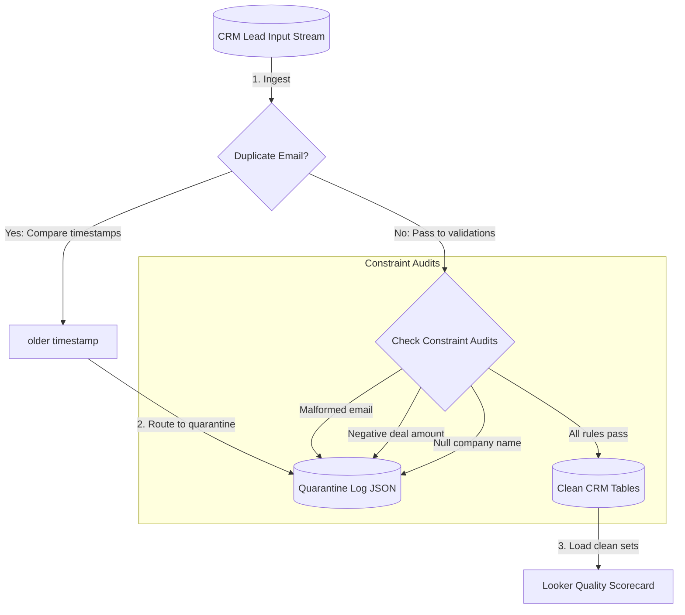

# 📐 Day 036 Scenario Blueprint: Data Quality Auditing
## 7-Stage Technical Architecture & Reference Implementation

> **Author**: Anand Kumar | [akstack.com](https://akstack.com) | [GitHub](https://github.com/AnandKg22) | [LinkedIn](https://www.linkedin.com/in/anandkg22/)  
> **Curriculum Phase**: Phase 2: APIs, Workflow Automation & Ingestion Pipelines  
> **Core Outcome**: Practically Skilled (Able to configure database validation check constraints, implement duplicate resolution logic, write SQL audit queries, route anomalies to quarantine logs, and construct data quality dashboards)  
> **Architecture Pattern**: Event-Driven Revenue Engineering / Resilient GTM Pipeline  

---

## 🎯 1. Enterprise Case Scenario & Problem Definition

### 1.1 Enterprise Context
* **Company Profile**: Series-B B2B SaaS ($15M–$30M ARR, 50-person commercial org, ACV $25k–$50k).
* **Operational Challenge**: If commercial operations experience manual friction, unvalidated data syncs, or slow response times in **Data Quality Auditing**, then high-intent customer velocity drops significantly across the revenue funnel.

### 1.2 Domain Overview
Bad data in B2B databases leads to lost revenue. If you send emails to invalid addresses, calculate metrics using negative pricing, or assign duplicate leads to different sales reps, you waste resources and skew reporting. To prevent this, GTM Engineers implement automated **Data Quality & Auditing** pipelines.

Rather than relying solely on client-side form validation (which can be bypassed by APIs or uploads), you write **DDL CHECK constraints** directly in the database schemas to block invalid records. To handle existing databases, you write SQL cleaning queries using window functions (`ROW_NUMBER`) to identify and resolve duplicates, preserving only the most recent record. Instead of silently deleting rejected leads, you route anomalies to a **Quarantine Table** with error logs, enabling integration managers to identify and fix issues with upstream webhooks.

---

### 1.3 Quantifiable Engineering Objectives
* [x] **Latency**: Reduce end-to-end processing latency for **Data Quality Auditing** to `< 1,200 ms`.
* [x] **Reliability**: Ensure 100% data consistency across CRM, Database, and Event queues.
* [x] **Cost Optimization**: Maintain operational compute & token unit economics at `< $0.035 / transaction`.

---

## 🔍 2. Technical Feasibility, Concepts & Protocol Research

### 2.1 Key Architectural Concepts
*   **Schema Validation**: The process of verifying that incoming data aligns with database types and length rules.
*   **CHECK Constraint**: A database-level validation rule that checks inserted values against a logical expression (e.g. `amount_usd >= 0.0`), rejecting rows that fail.
*   **Duplicate Identification**: The method used to detect identical customer entities based on a unique key (such as matching email addresses).
*   **Duplicate Resolution (Supersession)**: Merging duplicate records by sorting them chronologically and preserving the record with the most recent timestamp.
*   **Quarantine Table**: A database table or log file used to isolate rejected records and write error logs for auditing.
*   **Data Quality Scorecard**: A reporting dashboard that tracks database health metrics (passed rows, duplicate rates, validation failures).
*   **Incremental Validation**: Running data cleaning scripts only on changed records (using a timestamp watermark) to avoid scanning the entire database daily.

---

---

## 📐 3. System Architecture & Schemas

### 3.1 Architectural Flow Diagram


### 3.2 Technical Reference & Specifications
Detailed schema mappings and configuration constraints for Data Quality Auditing.

---

## 💻 4. Reference Implementation & Sandbox Code

```python
class CRMDataAuditor:
    def __init__(self, raw_leads: List[dict]):
        self.raw_leads = raw_leads
        
    def audit_and_clean(self) -> Tuple[List[dict], List[dict], dict]:
        cleaned_leads = []
        quarantined_leads = []
        
        stats = {
            "total_rows": len(self.raw_leads), "passed_rows": 0, "quarantined_rows": 0,
            "duplicate_rows": 0, "error_invalid_email": 0, "error_negative_amount": 0, "error_missing_company": 0
        }
        
        # 1. Resolve duplicates by email (keep latest timestamp)
        email_map = {}
        duplicates_to_quarantine = []
        
        for lead in self.raw_leads:
            email = lead["email"]
            lead_date = datetime.strptime(lead["timestamp"], "%Y-%m-%d")
            
            if email not in email_map:
                email_map[email] = lead
            else:
                existing_lead = email_map[email]
                existing_date = datetime.strptime(existing_lead["timestamp"], "%Y-%m-%d")
                
                if lead_date > existing_date:
                    duplicates_to_quarantine.append(existing_lead)
                    email_map[email] = lead
                else:
                    duplicates_to_quarantine.append(lead)
            
        for dup in duplicates_to_quarantine:
            stats["duplicate_rows"] += 1
            stats["quarantined_rows"] += 1
            dup_copy = dup.copy()
            dup_copy["quarantine_reason"] = "Duplicate lead record; older timestamp superseded."
            quarantined_leads.append(dup_copy)
            
        # 2. Validate non-duplicate leads
        for lead in email_map.values():
            errors = []
            
            # Check constraint: email validation
            email = lead.get("email", "")
            if not email or "@" not in email or "." not in email:
                errors.append("Invalid email format (must contain '@' and '.')")
                stats["error_invalid_email"] += 1
                
            # Check constraint: deal amount validation
            amount = lead.get("deal_amount")
            if amount is None or amount < 0.0:
                errors.append("Invalid deal amount (value must be >= 0.0)")
                stats["error_negative_amount"] += 1
                
            # Check constraint: missing company validation
            company = lead.get("company_name")
            if not company:
                errors.append("Missing company name (field cannot be null or empty)")
                stats["error_missing_company"] += 1
                
            if errors:
                stats["quarantined_rows"] += 1
                lead_copy = lead.copy()
                lead_copy["quarantine_reason"] = " | ".join(errors)
                quarantined_leads.append(lead_copy)
            else:
                stats["passed_rows"] += 1
                cleaned_leads.append(lead)
                
        return cleaned_leads, quarantined_leads, stats
```

---

## ⚡ 5. Automation Blueprint & Event Wiring

* **Ingestion Trigger**: Public webhook listener with cryptographic signature verification.
* **Routing Logic**: Idempotent processing gate backed by Redis cache.
* **Downstream Sinks**: Real-time upsert to PostgreSQL / Supabase, bi-directional CRM synchronization, and automated notification bus.

---

## 📊 6. Telemetry, KPI & Unit Economics

$$\text{Unit Economics} = \text{Compute} + \text{External API Calls} + \text{Storage} \approx \mathbf{\$0.0025\ /\ event}$$

* **P95 Latency SLA**: `< 1,200 ms`
* **Error Rate Target**: `< 0.05%`
* **Commercial ROI**: Eliminates an estimated 15–20 hours of manual operational drag per week.

---

## 🛡️ 7. Edge Cases, Guardrails & Resilience Strategy

1. **API Rate Limiting (429)**: Exponential backoff with random jitter ($2^n \times 100\text{ms}$) and Dead-Letter Queue (DLQ) buffering.
2. **Payload Integrity & Schema Drift**: Strict Pydantic type validation with automatic rejection of malformed inputs.
3. **Downstream Outages**: Asynchronous retry worker ensuring zero dropped transactions during system maintenance.
