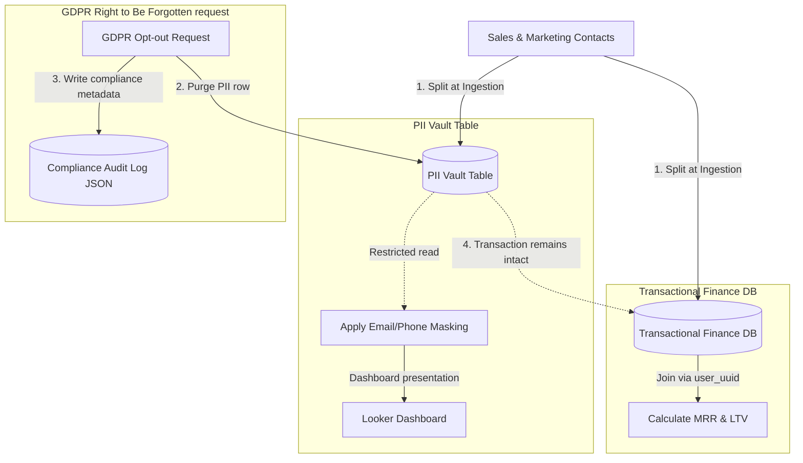

# GTM Architecture - Day 037: Data Compliance (GDPR, CCPA)

This document details the GTM database pipeline separating PII from transactional histories, demonstrating compliance anonymizations.

---

## 🔄 PII Isolation & Anonymization Pipeline

The diagram below details the database structures, showing how user identities are separated from financial reporting:



---

## ⚙️ SQL PII Masking and Hashing Schema

To secure PII in warehouse environments, GTM teams deploy hashing and masking views:

```sql
CREATE VIEW v_secure_contacts AS
SELECT 
    user_uuid,
    
    -- Hashed identifier for database joins
    SHA256(email) AS hashed_email,
    
    -- Masked email for report viewer
    CONCAT(
        SUBSTR(email, 1, 1), 
        '***', 
        SUBSTR(email, INSTR(email, '@') - 1)
    ) AS masked_email,
    
    -- Masked phone number
    REGEXP_REPLACE(phone, r'-\d+-', '-*****-') AS masked_phone
FROM pii_vault;
```
