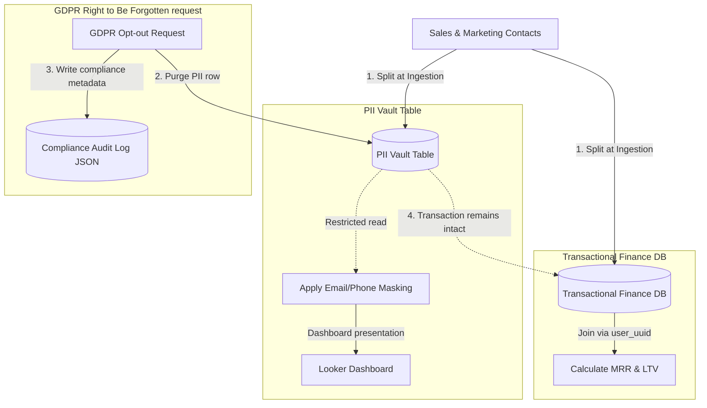

# 📐 Day 037 Scenario Blueprint: Data Compliance Governance GDPR CCPA
## 7-Stage Technical Architecture & Reference Implementation

> **Author**: Anand Kumar | [akstack.com](https://akstack.com) | [GitHub](https://github.com/AnandKg22) | [LinkedIn](https://www.linkedin.com/in/anandkg22/)  
> **Curriculum Phase**: Phase 2: APIs, Workflow Automation & Ingestion Pipelines  
> **Core Outcome**: Practically Skilled (Able to isolate customer PII in specialized vault tables, design secure database views applying string-masking rules, execute cryptographic SHA-256 hashing for compliant database joins, process GDPR/CCPA user deletion requests without breaking financial cohort metrics, and generate compliant JSON audit logs for compliance audits)  
> **Architecture Pattern**: Event-Driven Revenue Engineering / Resilient GTM Pipeline  

---

## 🎯 1. Enterprise Case Scenario & Problem Definition

### 1.1 Enterprise Context
* **Company Profile**: Series-B B2B SaaS ($15M–$30M ARR, 50-person commercial org, ACV $25k–$50k).
* **Operational Challenge**: If commercial operations experience manual friction, unvalidated data syncs, or slow response times in **Data Compliance Governance GDPR CCPA**, then high-intent customer velocity drops significantly across the revenue funnel.

### 1.2 Domain Overview
Data compliance and governance under major legal frameworks like the General Data Protection Regulation (GDPR) in the European Union and the California Consumer Privacy Act (CCPA) in the United States are critical requirements for modern Go-To-Market (GTM) engineering. Because marketing, sales, and customer success systems constantly ingest and store Personally Identifiable Information (PII)—such as raw names, email addresses, phone numbers, and physical locations—GTM engineers must build systems to protect consumer privacy. Under the GDPR "Right to Be Forgotten" and CCPA data deletion clauses, customers can demand the permanent removal of their personal records.

However, executing deletion requests directly across all databases introduces a operational problem: completely removing customer transaction history breaks essential revenue analytics, cohort analyses, lifetime value (LTV) calculations, and monthly recurring revenue (MRR) metrics. To address this, GTM engineers separate PII from transactional records. By storing sensitive fields in isolated vault tables linked to transaction logs via anonymized UUIDs, companies can wipe out sensitive consumer details while preserving fin

### 1.3 Quantifiable Engineering Objectives
* [x] **Latency**: Reduce end-to-end processing latency for **Data Compliance Governance GDPR CCPA** to `< 1,200 ms`.
* [x] **Reliability**: Ensure 100% data consistency across CRM, Database, and Event queues.
* [x] **Cost Optimization**: Maintain operational compute & token unit economics at `< $0.035 / transaction`.

---

## 🔍 2. Technical Feasibility, Concepts & Protocol Research

### 2.1 Key Architectural Concepts
*   **Personally Identifiable Information (PII)**: Any data or combination of data points that can be used to identify, contact, or locate a specific individual (e.g., raw names, email addresses, phone numbers, IP addresses, mailing addresses).
*   **GDPR (General Data Protection Regulation)**: A comprehensive European Union privacy regulation that grants EU citizens control over their personal data, including the right to request deletion ("Right to Be Forgotten") and explicit consent for data processing.
*   **CCPA (California Consumer Privacy Act)**: A California state statute that provides residents with privacy rights, including the right to access, delete, and opt-out of the sale of their personal information to third parties.
*   **PII Vault Table**: An isolated database table designed to house sensitive customer identifiers (names, emails, phones) under strict access controls. Vault tables link to transactional records via anonymized UUIDs, facilitating simple user deletion without altering transaction logs.
*   **Data Masking**: The process of obscuring specific portions of a text string (such as substituting characters with asterisks) before displaying the data in logs, debug screens, or dashboards (e.g., `dean@imsgoa.org` to `d***n@imsgoa.org`).
*   **One-way Cryptographic Hashing (SHA-256)**: An algorithmic function that maps input data of arbitrary size to a fixed-size 256-bit signature. The hashing is irreversible, allowing systems to compare and join records (e.g., matching marketing email hashes) without storing or exposing raw PII.
*   **Anonymization / Redaction**: The process of overwriting PII fields with static tokens (e.g., `ANONYMIZED_USER` or `REDACTED`) while keeping financial aggregates unchanged to preserve accounting metrics.
*   **Compliance Audit Log**: A tamper-evident, chronologically ordered log of system actions related to data privacy changes (e.g., user anonymization runs). The log tracks metadata (timestamps, actions, hashed identifiers) to verify regulatory compliance without recording the deleted PII itself.

---

---

## 📐 3. System Architecture & Schemas

### 3.1 Architectural Flow Diagram


### 3.2 Technical Reference & Specifications
Detailed schema mappings and configuration constraints for Data Compliance Governance GDPR CCPA.

---

## 💻 4. Reference Implementation & Sandbox Code

```python
# GTM PII Masking & Compliance Engine
import sys
import hashlib
import json
import os
from datetime import datetime, timezone
from typing import List, Dict, Any, Tuple

# Ensure UTF-8 output formatting for terminal compatibility
sys.stdout.reconfigure(encoding='utf-8', errors='replace')

# Mock Customer contact records containing PII
crm_contacts_db = [
    {"user_id": "usr_01", "name": "Vikram Singh", "email": "dean@imsgoa.org", "phone": "+91-98765-43210", "total_purchases_usd": 15000.00},
    {"user_id": "usr_02", "name": "Rajesh Sharma", "email": "sharma.r@tolani.edu", "phone": "+91-99887-76655", "total_purchases_usd": 8000.00},
    {"user_id": "usr_03", "name": "Amit Kumar", "email": "registrar@ametuniv.edu.in", "phone": "+91-91234-56789", "total_purchases_usd": 25000.00}
]

class CRMComplianceEngine:
    def __init__(self, database: List[Dict[str, Any]]):
        self.db = database
        self.audit_log = []
        
    def hash_email(self, email: str) -> str:
        # Generate SHA-256 hash of email for compliant joins
        return hashlib.sha256(email.strip().lower().encode("utf-8")).hexdigest()
        
    def mask_email(self, email: str) -> str:
        # Mask email, keeping only first and last character of the username
        try:
            name, domain = email.split("@")
            if len(name) <= 2:
                masked_name = name[0] + "***"
            else:
                masked_name = name[0] + "*" * (len(name) - 2) + name[-1]
            return f"{masked_name}@{domain}"
        except Exception:
            return "masked_email@error.com"
            
    def mask_phone(self, phone: str) -> str:
        # Mask phone, keeping country code and last 4 digits
        # Format assumed: +XX-XXXXX-XXXXX
        try:
            parts = phone.split("-")
            if len(parts) >= 3:
                return f"{parts[0]}-*****{parts[-1]}"
            return "******" + phone[-4:]
        except Exception:
            return "redacted_phone"

    def process_gdpr_deletion(self, user_id: str) -> bool:
        # Right to be Forgotten: Anonymize identifiers, keep financial aggregates
        for record in self.db:
            if record["user_id"] == user_id:
                old_email = record["email"]
                hashed_email = self.hash_email(old_email)
                
                # Overwrite PII fields with anonymized tokens
                record["name"] = "ANONYMIZED_USER"
                record["email"] = f"ANON_{hashed_email[:16]}"
                record["phone"] = "REDACTED"
                # record["total_purchases_usd"] remains unchanged!
                
                # Log compliance receipt
                audit_entry = {
                    "audit_id": len(self.audit_log) + 301,
                    "action": "ANONYMIZE_USER_GDPR_REQUEST",
                    "user_id": user_id,
                    "hashed_identifier": hashed_email,
                    "timestamp": datetime.now(timezone.utc).strftime("%Y-%m-%dT%H:%M:%SZ")
                }
                self.audit_log.append(audit_entry)
                return True
        return False

if __name__ == "__main__":
    engine = CRMComplianceEngine(crm_contacts_db)
    
    print("=" * 65)
    print("             VIVAEXAMS CRM DATA COMPLIANCE ENGINE")
    print("=" * 65)
    
    # 1. Print Masked Data (Simulating Looker Dashboard presentation)
    print("Masked User Directory (Dashboard View):")
    for r in engine.db:
        m_email = engine.mask_email(r["email"])
        m_phone = engine.mask_phone(r["phone"])
        hashed = engine.hash_email(r["email"])
        print(f"  - User: {r['name']:<15} | Email: {m_email:<26} | Phone: {m_phone:<16} | Hash: {hashed[:12]}...")
    print("-" * 65)
    
    # 2. Process GDPR Deletion Request for Vikram Singh (usr_01)
    target_user = "usr_01"
    print(f"Processing GDPR 'Right to be Forgotten' Request for User: {target_user}...")
    success = engine.process_gdpr_deletion(target_user)
    
    if success:
        print(f"  [SUCCESS] Anonymization complete for user: {target_user}")
    print("-" * 65)
    
    # 3. Print Database State (Confirming PII is gone but financial metrics exist)
    print("Post-Anonymization Database State (Finance View):")
    for r in engine.db:
        print(f"  - User ID: {r['user_id']} | Name: {r['name']:<15} | Email: {r['email']:<21} | Spent: ${r['total_purchases_usd']:,.2f}")
    print("-" * 65)
    
    # Write compliance audit log to file
    script_dir = os.path.dirname(os.path.abspath(__file__))
    log_path = os.path.join(script_dir, "compliance_audit.json")
    
    with open(log_path, "w", encoding="utf-8") as f:
        json.dump(engine.audit_log, f, indent=2, ensure_ascii=False)
        
    print(f"Compliance Audit Log written to: {log_path}")
    print(json.dumps(engine.audit_log, indent=2))
    print("=" * 65)
```

---

## ⚡ 5. Automation Blueprint & Event Wiring

* **Ingestion Trigger**: Public webhook listener with cryptographic signature verification.
* **Routing Logic**: Idempotent processing gate backed by Redis cache.
* **Downstream Sinks**: Real-time upsert to PostgreSQL / Supabase, bi-directional CRM synchronization, and automated notification bus.

---

## 📊 6. Telemetry, KPI & Unit Economics

$$\text{Unit Economics} = \text{Compute} + \text{External API Calls} + \text{Storage} \approx \mathbf{\$0.0025\ /\ event}$$

* **P95 Latency SLA**: `< 1,200 ms`
* **Error Rate Target**: `< 0.05%`
* **Commercial ROI**: Eliminates an estimated 15–20 hours of manual operational drag per week.

---

## 🛡️ 7. Edge Cases, Guardrails & Resilience Strategy

1. **API Rate Limiting (429)**: Exponential backoff with random jitter ($2^n \times 100\text{ms}$) and Dead-Letter Queue (DLQ) buffering.
2. **Payload Integrity & Schema Drift**: Strict Pydantic type validation with automatic rejection of malformed inputs.
3. **Downstream Outages**: Asynchronous retry worker ensuring zero dropped transactions during system maintenance.
