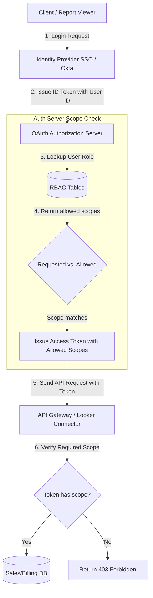

# GTM Architecture - Day 038: Security (OAuth & RBAC)

This document details the GTM security architecture mapping user requests through Single Sign-On (SSO), OAuth token scope intersections, and API Gateway RBAC controls.

---

## 🔄 OAuth & RBAC Authentication Flow

The diagram below details the pipeline, showing how client requests are checked and verified:



---

## ⚙️ SQL RBAC Directory Schema

To enforce roles and permissions, GTM Engineers deploy five normalized relational tables:

```sql
-- 1. Users Table
CREATE TABLE users (
    user_id SERIAL PRIMARY KEY,
    name VARCHAR(255) NOT NULL,
    email VARCHAR(255) UNIQUE NOT NULL
);

-- 2. Roles Table
CREATE TABLE roles (
    role_id SERIAL PRIMARY KEY,
    role_name VARCHAR(100) UNIQUE NOT NULL -- Admin, Sales, Marketing
);

-- 3. Scopes Table
CREATE TABLE permissions (
    permission_id SERIAL PRIMARY KEY,
    scope_key VARCHAR(100) UNIQUE NOT NULL -- contacts:read, billing:write
);

-- 4. User-Role Map (Junction Table)
CREATE TABLE user_roles (
    user_id INT REFERENCES users(user_id) ON DELETE CASCADE,
    role_id INT REFERENCES roles(role_id) ON DELETE CASCADE,
    PRIMARY KEY (user_id, role_id)
);

-- 5. Role-Permission Map (Junction Table)
CREATE TABLE role_permissions (
    role_id INT REFERENCES roles(role_id) ON DELETE CASCADE,
    permission_id INT REFERENCES permissions(permission_id) ON DELETE CASCADE,
    PRIMARY KEY (role_id, permission_id)
);
```
