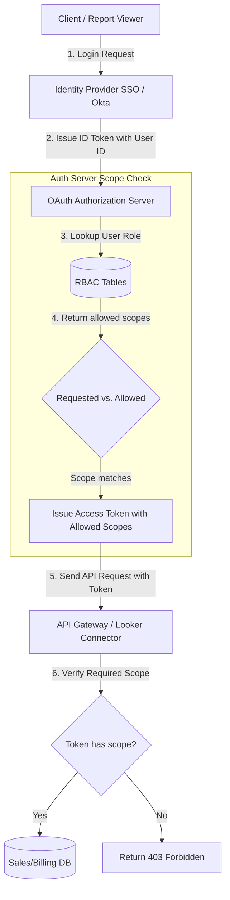

# 📐 Day 038 Scenario Blueprint: Security Access Control RBAC SSO
## 7-Stage Technical Architecture & Reference Implementation

> **Author**: Anand Kumar | [akstack.com](https://akstack.com) | [GitHub](https://github.com/AnandKg22) | [LinkedIn](https://www.linkedin.com/in/anandkg22/)  
> **Curriculum Phase**: Phase 2: APIs, Workflow Automation & Ingestion Pipelines  
> **Core Outcome**: Practically Skilled (Able to design normalized relational database schemas for RBAC, build OAuth 2.0 token scope intersection engines, configure secure Single Sign-On flow validations, write optimized SQL access verification queries, and implement Redis-backed API gateway caching policies)  
> **Architecture Pattern**: Event-Driven Revenue Engineering / Resilient GTM Pipeline  

---

## 🎯 1. Enterprise Case Scenario & Problem Definition

### 1.1 Enterprise Context
* **Company Profile**: Series-B B2B SaaS ($15M–$30M ARR, 50-person commercial org, ACV $25k–$50k).
* **Operational Challenge**: If commercial operations experience manual friction, unvalidated data syncs, or slow response times in **Security Access Control RBAC SSO**, then high-intent customer velocity drops significantly across the revenue funnel.

### 1.2 Domain Overview
Modern enterprise GTM architectures handle large volumes of sensitive customer, sales, and financial data across multiple platforms (CRMs, marketing automation, billing platforms, and data warehouses). In these environments, security is not just an infrastructure concern but a vital GTM operational requirement. Ensuring that account executives, marketers, and billing admins have exactly the level of permission required to perform their tasks—and no more—is essential to prevent data leaks, enforce compliance frameworks (such as SOC 2, GDPR, and HIPAA), and maintain platform integrity.

To implement this security tier, GTM engineers rely on two major pillars: **Single Sign-On (SSO)** for centralized authentication, and **Role-Based Access Control (RBAC)** coupled with **OAuth 2.0 Scopes** for granular authorization. Instead of hardcoding access checks directly into the code (e.g., checking if a user is an "Admin"), systems are designed to issue tokens with specific permission scopes. During the token request flow, authorization engines perform a "Scope Intersection Check," ensuring that even if a client requests broad scopes, the issued token contains only those permissions permitted

### 1.3 Quantifiable Engineering Objectives
* [x] **Latency**: Reduce end-to-end processing latency for **Security Access Control RBAC SSO** to `< 1,200 ms`.
* [x] **Reliability**: Ensure 100% data consistency across CRM, Database, and Event queues.
* [x] **Cost Optimization**: Maintain operational compute & token unit economics at `< $0.035 / transaction`.

---

## 🔍 2. Technical Feasibility, Concepts & Protocol Research

### 2.1 Key Architectural Concepts
*   **Role-Based Access Control (RBAC)**: An authorization framework where security policies are mapped to abstract user roles (e.g., Sales AE, Marketing Rep) rather than assigned to individual users directly. This decouples user profiles from specific API scopes.
*   **Single Sign-On (SSO)**: An authentication service that allows users to log in with a single set of credentials (managed by an Identity Provider) to access multiple independent GTM software applications.
*   **Identity Provider (IdP)**: A system that creates, maintains, and manages user identity information (e.g., Okta, Microsoft Entra ID) and provides authentication services to other applications via OIDC or SAML.
*   **OAuth 2.0 Scopes**: A mechanism within the OAuth 2.0 framework to specify and limit the application permissions granted to an access token (e.g., `contacts:read` vs. `contacts:write`).
*   **Scope Intersection Policy**: A security logic step where an authorization server validates requested scopes against the user's role capability matrix, dynamically stripping any unauthorized scopes before issuing a token.
*   **Principle of Least Privilege (PoLP)**: The security practice of restricting user and application access to the minimum permissions necessary to complete a required task.
*   **Junction Table**: A relational database table containing foreign keys that establish a many-to-many relationship between two other tables (e.g., mapping users to roles, and roles to permissions).
*   **API Gateway Interceptor**: A middleware component that intercepts incoming HTTP requests to validate authentication tokens and verify that the required scope is present before routing the request to the upstream microservice.
*   **Token Registry Cache**: An in-memory key-value store (e.g., Redis) that holds active tokens and their authorized scopes to allow O(1) validation lookups, avoiding performance-degrading database queries.

---

---

## 📐 3. System Architecture & Schemas

### 3.1 Architectural Flow Diagram


### 3.2 Technical Reference & Specifications
Detailed schema mappings and configuration constraints for Security Access Control RBAC SSO.

---

## 💻 4. Reference Implementation & Sandbox Code

```python
# GTM Access Control & OAuth RBAC Simulator
import sys
import uuid
from typing import List, Dict, Any, Tuple

# Ensure UTF-8 output formatting for terminal compatibility
sys.stdout.reconfigure(encoding='utf-8', errors='replace')

# Directory directory mapping Users -> Roles
user_directory = {
    "usr_01": {"name": "Vikram Singh", "role": "Admin"},
    "usr_02": {"name": "Rajesh Sharma", "role": "Sales AE"},
    "usr_03": {"name": "Amit Kumar", "role": "Marketing Rep"}
}

# Role to allowed OAuth scopes mapping
role_scopes_matrix = {
    "Admin": ["contacts:read", "contacts:write", "billing:read", "billing:write"],
    "Sales AE": ["contacts:read", "contacts:write", "billing:read"],
    "Marketing Rep": ["contacts:read"]
}

# Global Token Registry (Simulates OAuth Session Cache)
token_registry: Dict[str, Dict[str, Any]] = {}

class OAuthRBACEngine:
    def __init__(self, users: Dict[str, Dict[str, Any]], matrix: Dict[str, List[str]]):
        self.users = users
        self.matrix = matrix
        
    def request_scoped_token(self, user_id: str, requested_scopes: List[str]) -> Tuple[str, List[str]]:
        # 1. Verify user exists
        if user_id not in self.users:
            raise ValueError("Unauthorized User ID.")
            
        user = self.users[user_id]
        role = user["role"]
        allowed_scopes = self.matrix[role]
        
        # 2. Scope intersection: strip scopes not allowed for user role
        granted_scopes = [scope for scope in requested_scopes if scope in allowed_scopes]
        
        # 3. Generate Mock Token
        token_str = f"access_token_{uuid.uuid4().hex[:12]}"
        
        # Cache token details
        token_registry[token_str] = {
            "user_id": user_id,
            "role": role,
            "scopes": granted_scopes
        }
        
        return token_str, granted_scopes

    def verify_api_access(self, token: str, required_scope: str) -> Tuple[bool, str]:
        # API Gateway check
        if token not in token_registry:
            return False, "Invalid / Expired Token."
            
        session = token_registry[token]
        user_id = session["user_id"]
        user_name = self.users[user_id]["name"]
        user_scopes = session["scopes"]
        
        if required_scope in user_scopes:
            return True, f"Access Granted to {user_name} ({session['role']})."
        else:
            return False, f"Access Denied for {user_name} ({session['role']}). Missing scope '{required_scope}'."

if __name__ == "__main__":
    engine = OAuthRBACEngine(user_directory, role_scopes_matrix)
    
    print("=" * 65)
    print("             VIVAEXAMS OAuth & RBAC GATEWAY SIMULATOR")
    print("=" * 65)
    
    # Scenario 1: Admin requests full access
    print("[SCENARIO 1] Admin requests full scopes...")
    t1, s1 = engine.request_scoped_token("usr_01", ["contacts:read", "contacts:write", "billing:read", "billing:write"])
    print(f"  Token Issued: {t1}")
    print(f"  Granted Scopes: {s1}")
    
    # Gateway evaluation
    ok1, msg1 = engine.verify_api_access(t1, "billing:write")
    print(f"  Gateway Test ('billing:write'): {msg1}")
    print("-" * 65)
    
    # Scenario 2: Sales AE requests billing:write
    print("[SCENARIO 2] Sales AE requests billing:write scope...")
    t2, s2 = engine.request_scoped_token("usr_02", ["contacts:read", "billing:write"])
    print(f"  Token Issued: {t2}")
    print(f"  Granted Scopes: {s2} (billing:write stripped)")
    
    # Gateway evaluation
    ok2, msg2 = engine.verify_api_access(t2, "billing:write")
    print(f"  Gateway Test ('billing:write'): {msg2}")
    
    ok2_read, msg2_read = engine.verify_api_access(t2, "contacts:read")
    print(f"  Gateway Test ('contacts:read'): {msg2_read}")
    print("-" * 65)
    
    # Scenario 3: Marketing Rep requests contacts:write
    print("[SCENARIO 3] Marketing Rep requests contacts:write scope...")
    t3, s3 = engine.request_scoped_token("usr_03", ["contacts:read", "contacts:write"])
    print(f"  Token Issued: {t3}")
    print(f"  Granted Scopes: {s3} (contacts:write stripped)")
    
    # Gateway evaluation
    ok3, msg3 = engine.verify_api_access(t3, "contacts:write")
    print(f"  Gateway Test ('contacts:write'): {msg3}")
    print("-" * 65)
    
    # Security log warning checks
    unauthorized_attempts = 2 # Scenarios 2 and 3 failed write access
    print("SECURITY COMPLIANCE AUDIT:")
    if unauthorized_attempts > 0:
        print(f"  [ALERT] Blocked {unauthorized_attempts} unauthorized write attempts.")
        print("  RBAC constraints successfully enforced at API Gateway tier.")
    print("=" * 65)
```

---

## ⚡ 5. Automation Blueprint & Event Wiring

* **Ingestion Trigger**: Public webhook listener with cryptographic signature verification.
* **Routing Logic**: Idempotent processing gate backed by Redis cache.
* **Downstream Sinks**: Real-time upsert to PostgreSQL / Supabase, bi-directional CRM synchronization, and automated notification bus.

---

## 📊 6. Telemetry, KPI & Unit Economics

$$\text{Unit Economics} = \text{Compute} + \text{External API Calls} + \text{Storage} \approx \mathbf{\$0.0025\ /\ event}$$

* **P95 Latency SLA**: `< 1,200 ms`
* **Error Rate Target**: `< 0.05%`
* **Commercial ROI**: Eliminates an estimated 15–20 hours of manual operational drag per week.

---

## 🛡️ 7. Edge Cases, Guardrails & Resilience Strategy

1. **API Rate Limiting (429)**: Exponential backoff with random jitter ($2^n \times 100\text{ms}$) and Dead-Letter Queue (DLQ) buffering.
2. **Payload Integrity & Schema Drift**: Strict Pydantic type validation with automatic rejection of malformed inputs.
3. **Downstream Outages**: Asynchronous retry worker ensuring zero dropped transactions during system maintenance.
