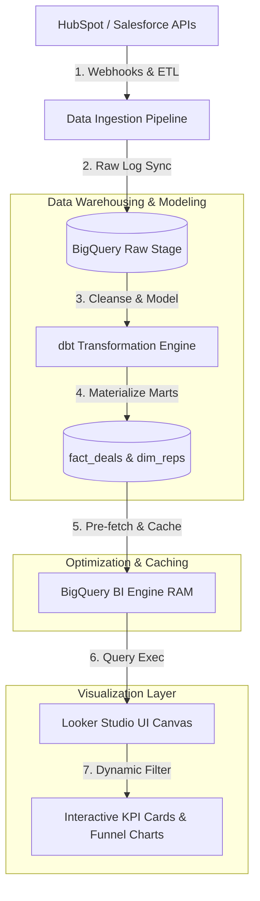

# GTM Architecture - Day 039: GTM Control Center

This document details the data pipeline architecture and database schemas that support executive GTM dashboards with dynamic filtering, weighted forecasting, and real-time updates.

---

## 🔄 GTM Dashboard Data Pipeline

The diagram below details the pipeline, showing how deals are ingested from CRMs, aggregated in the warehouse, and rendered in the Looker Studio dashboard:



---

## ⚙️ Relational Deals Schema

To feed the dashboard, dbt materializes a consolidated fact deals table (`fact_deals`) and a dimension reps table (`dim_reps`) in the data warehouse:

```sql
-- 1. Sales Representatives Dimension Table
CREATE TABLE dim_reps (
    sales_rep_id VARCHAR(50) PRIMARY KEY,
    name VARCHAR(255) NOT NULL,
    email VARCHAR(255) UNIQUE NOT NULL,
    region VARCHAR(50) NOT NULL
);

-- 2. Fact Deals Table (Transactional)
CREATE TABLE fact_deals (
    deal_id INT PRIMARY KEY,
    company_name VARCHAR(255) NOT NULL,
    value NUMERIC(12, 2) NOT NULL,
    stage VARCHAR(100) NOT NULL, -- Discovery, Qualification, Proposal, Negotiation, Closed Won, Closed Lost
    sales_rep_id VARCHAR(50) REFERENCES dim_reps(sales_rep_id),
    segment VARCHAR(50) NOT NULL, -- Enterprise, Mid-Market, SMB
    created_at TIMESTAMP DEFAULT CURRENT_TIMESTAMP,
    updated_at TIMESTAMP DEFAULT CURRENT_TIMESTAMP
);
```

---

## 📊 Dashboard Aggregation Components

The GTM Control Center operates through four core architectural layers:

1.  **Data Ingestion**: Captures CRM webhook events (e.g., deal moved from Proposal to Closed Won) and stream-updates the database.
2.  **Aggregation Layer**: Runs SQL queries to compute ARR, MRR, weighted forecast values, and funnel stage counts.
3.  **Caching & Optimization**: Reserves RAM cache capacity (e.g., using Google BI Engine) to avoid expensive database table scans whenever a viewer modifies dashboard drop-down filters.
4.  **Presentation Layer**: Renders high-level summary cards (financial KPIs), stage conversion funnels (ASCII histograms), and granular tables (sales rep performance reports).
