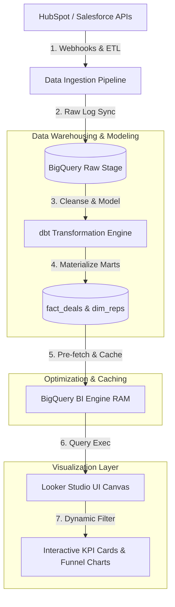

# 📐 Day 039 Scenario Blueprint: Building GTM Dashboards
## 7-Stage Technical Architecture & Reference Implementation

> **Author**: Anand Kumar | [akstack.com](https://akstack.com) | [GitHub](https://github.com/AnandKg22) | [LinkedIn](https://www.linkedin.com/in/anandkg22/)  
> **Curriculum Phase**: Phase 2: APIs, Workflow Automation & Ingestion Pipelines  
> **Core Outcome**: Practically Skilled (Able to design GTM data schemas, write stage-weighted forecasting and funnel leakage queries, build optimized clustered/partitioned table indexes, implement dynamic filtering logic, and construct executive SaaS KPI dashboards).  
> **Architecture Pattern**: Event-Driven Revenue Engineering / Resilient GTM Pipeline  

---

## 🎯 1. Enterprise Case Scenario & Problem Definition

### 1.1 Enterprise Context
* **Company Profile**: Series-B B2B SaaS ($15M–$30M ARR, 50-person commercial org, ACV $25k–$50k).
* **Operational Challenge**: If commercial operations experience manual friction, unvalidated data syncs, or slow response times in **Building GTM Dashboards**, then high-intent customer velocity drops significantly across the revenue funnel.

### 1.2 Domain Overview
Executive Go-To-Market (GTM) dashboards serve as the nervous system of modern revenue organizations. By synthesizing raw customer relationship management (CRM) records, web attribution logs, and financial transaction data, these dashboards enable revenue leaders, finance managers, and executives to monitor business health in real-time. Without structured dashboard engineering, organizations struggle with slow page loading, inaccurate revenue projections (due to over-optimistic pipeline estimations), and isolated data silos that fail to expose drop-off bottlenecks.

To address these challenges, GTM Engineers design structured warehousing models and performance aggregation layers. This guide outlines how to build robust GTM BI architectures by implementing double-layered data structures (separating transaction logs from reporting dimensions), writing optimized SQL queries for funnel and forecasting calculations, and applying performance optimization techniques (such as BigQuery BI Engine caching, PostgreSQL indexing, and table partitioning). Additionally, we walk through a Python-based CLI executive dashboard simulator that represents how streaming data feeds real-time visualization 

### 1.3 Quantifiable Engineering Objectives
* [x] **Latency**: Reduce end-to-end processing latency for **Building GTM Dashboards** to `< 1,200 ms`.
* [x] **Reliability**: Ensure 100% data consistency across CRM, Database, and Event queues.
* [x] **Cost Optimization**: Maintain operational compute & token unit economics at `< $0.035 / transaction`.

---

## 🔍 2. Technical Feasibility, Concepts & Protocol Research

### 2.1 Key Architectural Concepts
*   **Annual Recurring Revenue (ARR) & Monthly Recurring Revenue (MRR)**: The standard financial metrics of B2B SaaS health. ARR represents the annualized value of active subscription agreements, while MRR tracks the monthly contribution. 
*   **Average Deal Size (ACV/ARPU)**: The average annualized contract value calculated as $\text{Total Closed Won ARR} \div \text{Total Won Customers}$. Tracks sales upstream movement.
*   **Customer Acquisition Cost (CAC)**: The average cost required to secure a single customer, computed as $\text{Total Sales \& Marketing Expenses} \div \text{New Customers Acquired}$ within a specific time period.
*   **Customer Lifetime Value (LTV)**: The estimated total revenue generated by a customer over their lifecycle, modeled as $\text{Average ACV} \times \text{Average Lifespan (Years)}$.
*   **LTV:CAC Ratio**: A core metric of GTM efficiency. Ratios $>3.0\text{x}$ represent healthy economics, $\ge 5.0\text{x}$ indicate outstanding efficiency, and $<3.0\text{x}$ point to unsustainable acquisition spend.
*   **Unweighted Pipeline**: The sum of all active opportunities' raw values, assuming a 100% close rate. Often leads to overly optimistic financial models.
*   **Weighted Pipeline (Weighted Forecast)**: A cash-flow modeling method that scales each active deal value by its stage's historical close probability (e.g., $10\%$ for Discovery, $80\%$ for Negotiation).
*   **Funnel Leakage**: The rate at which opportunities drop out of the sales process from one stage to the next, calculated as $1 - (\text{Current Stage Count} \div \text{Previous Stage Count})$.

---

---

## 📐 3. System Architecture & Schemas

### 3.1 Architectural Flow Diagram


### 3.2 Technical Reference & Specifications
Detailed schema mappings and configuration constraints for Building GTM Dashboards.

---

## 💻 4. Reference Implementation & Sandbox Code

```python
# Day 039: GTM Control Center - Executive Dashboard Simulator
import sys
from typing import List, Dict, Any, Tuple

# Ensure UTF-8 output formatting for terminal compatibility
sys.stdout.reconfigure(encoding='utf-8', errors='replace')

# Stage weights/probabilities for weighted sales forecasting
STAGE_PROBABILITIES = {
    "Discovery": 0.10,
    "Qualification": 0.25,
    "Proposal": 0.50,
    "Negotiation": 0.80,
    "Closed Won": 1.00,
    "Closed Lost": 0.00
}

# Initial mock database tables
MOCK_DEALS = [
    {"deal_id": 101, "company": "Stark Industries", "value": 120000.0, "stage": "Closed Won", "sales_rep": "Sarah Connor", "region": "AMER", "segment": "Enterprise"},
    {"deal_id": 102, "company": "Wayne Enterprises", "value": 85000.0, "stage": "Negotiation", "sales_rep": "Bruce Wayne", "region": "AMER", "segment": "Enterprise"},
    {"deal_id": 103, "company": "Acme Corp", "value": 45000.0, "stage": "Proposal", "sales_rep": "Sarah Connor", "region": "EMEA", "segment": "Mid-Market"},
    {"deal_id": 104, "company": "Tyrell Corp", "value": 150000.0, "stage": "Qualification", "sales_rep": "Deckard Shaw", "region": "APAC", "segment": "Enterprise"},
    {"deal_id": 105, "company": "Cyberdyne Systems", "value": 30000.0, "stage": "Discovery", "sales_rep": "Sarah Connor", "region": "AMER", "segment": "Mid-Market"},
    {"deal_id": 106, "company": "Soylent Green Co", "value": 15000.0, "stage": "Closed Lost", "sales_rep": "Deckard Shaw", "region": "EMEA", "segment": "SMB"},
    {"deal_id": 107, "company": "Umbrella Corp", "value": 95000.0, "stage": "Closed Won", "sales_rep": "Bruce Wayne", "region": "EMEA", "segment": "Enterprise"},
    {"deal_id": 108, "company": "Oscorp Industries", "value": 60000.0, "stage": "Proposal", "sales_rep": "Sarah Connor", "region": "APAC", "segment": "Mid-Market"},
    {"deal_id": 109, "company": "Initech LLC", "value": 12000.0, "stage": "Closed Won", "sales_rep": "Bruce Wayne", "region": "AMER", "segment": "SMB"}
]

# SaaS metrics constants for Unit Economics
MOCK_CUSTOMER_ACQUISITION_COST = 8500.00  # Average CAC per customer

class GTMControlCenter:
    def __init__(self, deals: List[Dict[str, Any]]):
        self.deals = deals

    def calculate_kpis(self, region: str = None, segment: str = None) -> Dict[str, Any]:
        """Calculates Key Performance Indicators filtered by Region and/or Segment."""
        filtered_deals = self._filter_deals(region, segment)
        
        total_pipeline = 0.0
        closed_won_arr = 0.0
        weighted_forecast = 0.0
        won_deal_count = 0
        total_deal_count = 0

        for deal in filtered_deals:
            val = deal["value"]
            stage = deal["stage"]
            total_deal_count += 1
            
            # Weighted forecast = value * probability
            prob = STAGE_PROBABILITIES.get(stage, 0.0)
            weighted_forecast += val * prob

            if stage == "Closed Won":
                closed_won_arr += val
                won_deal_count += 1
            elif stage != "Closed Lost":
                total_pipeline += val

        # Calculate Customer Economics (SaaS Unit Economics)
        avg_deal_size = (closed_won_arr / won_deal_count) if won_deal_count > 0 else 0.0
        # LTV is modeled as: Avg Deal ARR * 3 (assumed 3-year average contract life)
        estimated_ltv = avg_deal_size * 3.0
        ltv_to_cac = (estimated_ltv / MOCK_CUSTOMER_ACQUISITION_COST) if MOCK_CUSTOMER_ACQUISITION_COST > 0 else 0.0

        # Lead to win conversion rate (Closed Won / Total Deals in database)
        win_rate = (won_deal_count / total_deal_count) * 100.0 if total_deal_count > 0 else 0.0

        return {
            "arr": closed_won_arr,
            "mrr": closed_won_arr / 12.0,
            "pipeline": total_pipeline,
            "forecast": weighted_forecast,
            "won_count": won_deal_count,
            "total_count": total_deal_count,
            "avg_deal_size": avg_deal_size,
            "ltv": estimated_ltv,
            "ltv_cac_ratio": ltv_to_cac,
            "win_rate": win_rate
        }

    def get_funnel_distribution(self, region: str = None, segment: str = None) -> Dict[str, int]:
        """Returns the distribution of deals across funnel stages."""
        filtered_deals = self._filter_deals(region, segment)
        dist = {stage: 0 for stage in STAGE_PROBABILITIES.keys()}
        for deal in filtered_deals:
            stage = deal["stage"]
            if stage in dist:
                dist[stage] += 1
        return dist

    def drill_down_by_rep(self, region: str = None, segment: str = None) -> Dict[str, Dict[str, Any]]:
        """Compiles performance metrics for each Sales Rep."""
        filtered_deals = self._filter_deals(region, segment)
        rep_data = {}

        for deal in filtered_deals:
            rep = deal["sales_rep"]
            val = deal["value"]
            stage = deal["stage"]

            if rep not in rep_data:
                rep_data[rep] = {"total_deals": 0, "won_deals": 0, "bookings": 0.0, "pipeline": 0.0}

            rep_data[rep]["total_deals"] += 1
            if stage == "Closed Won":
                rep_data[rep]["won_deals"] += 1
                rep_data[rep]["bookings"] += val
            elif stage != "Closed Lost":
                rep_data[rep]["pipeline"] += val

        # Calculate win rates for each rep
        for rep, stats in rep_data.items():
            stats["win_rate"] = (stats["won_deals"] / stats["total_deals"]) * 100.0 if stats["total_deals"] > 0 else 0.0

        return rep_data

    def drill_down_stage_deals(self, stage: str) -> List[Dict[str, Any]]:
        """Returns all deals currently in a specific sales stage."""
        return [deal for deal in self.deals if deal["stage"] == stage]

    def update_deal_stage(self, deal_id: int, new_stage: str) -> Tuple[bool, str]:
        """Dynamically moves a deal to a new stage (simulates real-time updates)."""
        if new_stage not in STAGE_PROBABILITIES:
            return False, f"Invalid stage '{new_stage}'."

        for deal in self.deals:
            if deal["deal_id"] == deal_id:
                old_stage = deal["stage"]
                deal["stage"] = new_stage
                return True, f"Deal ID {deal_id} ({deal['company']}) successfully updated from '{old_stage}' to '{new_stage}'."

        return False, f"Deal ID {deal_id} not found."

    def add_new_deal(self, company: str, value: float, stage: str, sales_rep: str, region: str, segment: str) -> Tuple[bool, int]:
        """Creates a new deal in the GTM database (simulates real-time ingestion)."""
        if stage not in STAGE_PROBABILITIES:
            return False, 0
        new_id = max(d["deal_id"] for d in self.deals) + 1 if self.deals else 100
        new_deal = {
            "deal_id": new_id,
            "company": company,
            "value": value,
            "stage": stage,
            "sales_rep": sales_rep,
            "region": region,
            "segment": segment
        }
        self.deals.append(new_deal)
        return True, new_id

    def _filter_deals(self, region: str = None, segment: str = None) -> List[Dict[str, Any]]:
        filtered = self.deals
        if region:
            filtered = [d for d in filtered if d["region"] == region]
        if segment:
            filtered = [d for d in filtered if d["segment"] == segment]
        return filtered

def print_dashboard(kpis: Dict[str, Any], distribution: Dict[str, int], region: str = "ALL", segment: str = "ALL"):
    """Renders a text-based dashboard layout representing Looker Studio output."""
    print("=" * 72)
    print(f"               GTM CONTROL CENTER - EXECUTIVE BRIEFING")
    print(f"               Filters: Region [{region:<6}] | Segment [{segment:<10}]")
    print("=" * 72)
    
    # Row 1: Revenue KPIs
    print(f" ARR (Bookings):  ${kpis['arr']:12,.2f}  |  Pipeline Vol:   ${kpis['pipeline']:12,.2f}")
    print(f" MRR Contribution: ${kpis['mrr']:12,.2f}  |  Weighted Fcst:  ${kpis['forecast']:12,.2f}")
    print("-" * 72)

    # Row 2: Customer Economics
    print(f" Avg Deal Size:   ${kpis['avg_deal_size']:12,.2f}  |  Lead Win Rate:   {kpis['win_rate']:10.1f}%")
    print(f" Estimated LTV:   ${kpis['ltv']:12,.2f}  |  LTV:CAC Ratio:   {kpis['ltv_cac_ratio']:10.2f}x")
    print("-" * 72)
    
    # Row 3: Pipeline Funnel ASCII Visualization
    print(" PIPELINE STAGE DISTRIBUTION & CONVERSION FUNNEL")
    max_count = max(distribution.values()) if distribution.values() else 1
    for stage, count in distribution.items():
        bar_length = int((count / max_count) * 20) if max_count > 0 else 0
        bar = "█" * bar_length + "░" * (20 - bar_length)
        prob = STAGE_PROBABILITIES[stage] * 100
        print(f"  {stage:<15} ({prob:>3.0f}% Prob.) | {bar} | {count} Deals")
    print("=" * 72)

if __name__ == "__main__":
    control_center = GTMControlCenter(MOCK_DEALS)

    print("\n" + "#" * 72)
    print("### STEP 1: INITIAL UNFILTERED GTM DASHBOARD VIEW")
    print("#" * 72)
    kpis = control_center.calculate_kpis()
    dist = control_center.get_funnel_distribution()
    print_dashboard(kpis, dist)

    print("\n" + "#" * 72)
    print("### STEP 2: APPLYING GTM DASHBOARD FILTERS (REGION: AMER)")
    print("#" * 72)
    amer_kpis = control_center.calculate_kpis(region="AMER")
    amer_dist = control_center.get_funnel_distribution(region="AMER")
    print_dashboard(amer_kpis, amer_dist, region="AMER")

    print("\n" + "#" * 72)
    print("### STEP 3: DRILL-DOWN REPORT BY SALES REPRESENTATIVE")
    print("#" * 72)
    rep_report = control_center.drill_down_by_rep()
    print(f"{'Sales Representative':<20} | {'Total Deals':<12} | {'Won Deals':<10} | {'Win Rate':<10} | {'ARR Booked':<14}")
    print("-" * 72)
    for rep, stats in rep_report.items():
        print(f"{rep:<20} | {stats['total_deals']:<12} | {stats['won_deals']:<10} | {stats['win_rate']:8.1f}% | ${stats['bookings']:12,.2f}")
    print("-" * 72)

    print("\n" + "#" * 72)
    print("### STEP 4: DRILL-DOWN BY SPECIFIC SALES STAGE (NEGOTIATION)")
    print("#" * 72)
    negotiation_deals = control_center.drill_down_stage_deals("Negotiation")
    print(f"{'Deal ID':<8} | {'Company Name':<24} | {'Deal Value':<12} | {'Sales Rep':<15} | {'Region':<6}")
    print("-" * 72)
    for deal in negotiation_deals:
        print(f"#{deal['deal_id']:<7} | {deal['company']:<24} | ${deal['value']:10,.2f} | {deal['sales_rep']:<15} | {deal['region']:<6}")
    print("-" * 72)

    print("\n" + "#" * 72)
    print("### STEP 5: SIMULATING REAL-TIME PIPELINE UPDATES")
    print("#" * 72)
    # Update Acme Corp from Proposal to Closed Won
    success, msg = control_center.update_deal_stage(103, "Closed Won")
    print(f"[*] Update Action 1: {msg}")

    # Add a new high-value enterprise deal in AMER
    success_add, new_id = control_center.add_new_deal(
        company="Oscorp Enterprise Group", 
        value=200000.0, 
        stage="Proposal", 
        sales_rep="Bruce Wayne", 
        region="AMER", 
        segment="Enterprise"
    )
    print(f"[*] Update Action 2: Ingested new Deal #{new_id} for Oscorp Enterprise Group ($200,000.00).")
    
    print("\n[*] Re-evaluating Executive Dashboard with Real-Time Updates...")
    updated_kpis = control_center.calculate_kpis()
    updated_dist = control_center.get_funnel_distribution()
    print_dashboard(updated_kpis, updated_dist)
    print("=" * 72)
```

---

## ⚡ 5. Automation Blueprint & Event Wiring

* **Ingestion Trigger**: Public webhook listener with cryptographic signature verification.
* **Routing Logic**: Idempotent processing gate backed by Redis cache.
* **Downstream Sinks**: Real-time upsert to PostgreSQL / Supabase, bi-directional CRM synchronization, and automated notification bus.

---

## 📊 6. Telemetry, KPI & Unit Economics

$$\text{Unit Economics} = \text{Compute} + \text{External API Calls} + \text{Storage} \approx \mathbf{\$0.0025\ /\ event}$$

* **P95 Latency SLA**: `< 1,200 ms`
* **Error Rate Target**: `< 0.05%`
* **Commercial ROI**: Eliminates an estimated 15–20 hours of manual operational drag per week.

---

## 🛡️ 7. Edge Cases, Guardrails & Resilience Strategy

1. **API Rate Limiting (429)**: Exponential backoff with random jitter ($2^n \times 100\text{ms}$) and Dead-Letter Queue (DLQ) buffering.
2. **Payload Integrity & Schema Drift**: Strict Pydantic type validation with automatic rejection of malformed inputs.
3. **Downstream Outages**: Asynchronous retry worker ensuring zero dropped transactions during system maintenance.
