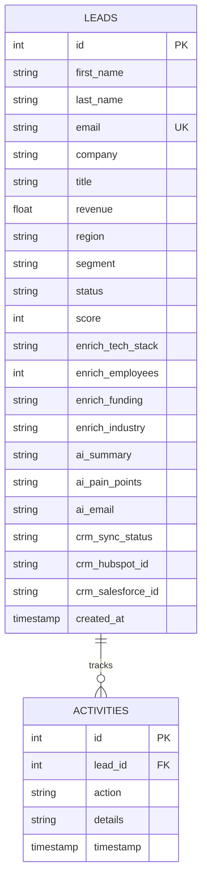

# GTM Architecture - Day 040: AI Revenue Automation Platform (ARAP) v1

This document specifies the system architecture, database schemas, and workflow pipelines for the **AI Revenue Automation Platform (ARAP) v1** capstone project.

---

## 🔄 System Architecture Pipeline

The diagram below outlines the ARAP v1 architecture, detailing how lead data flows from ingestion to data enrichment, AI insights, and final CRM sync:

```mermaid
graph TD
    User[Sales Manager / Lead Intake] -->|1. Submit Lead Form| WebClient[Glassmorphic HTML/JS UI]
    WebClient -->|2. POST /api/leads| Server[Flask API Gateway]
    
    subgraph Database Storage (SQLite)
        Server -->|3. Save Lead Record| DB[(SQLite Database)]
        Server -->|4. Log Ingestion Event| DB
    end
    
    subgraph Automated Revenue Pipeline
        Server -->|5. Firmographic Check| Enrich[Enrichment Engine / Clearbit API]
        Enrich -->|6. Calculate Score| Scorer[Lead Scoring Engine]
        Scorer -->|7. Generate Outreach & Pain Points| LLM[Gemini AI Copywriter]
    end
    
    LLM -->|8. Update Enriched Status| DB
    
    subgraph CRM Synchronization & Notification
        WebClient -->|9. Trigger Push /api/leads/id/crm-sync| Server
        Server -->|10. Push Contact| HubSpot[HubSpot CRM API]
        Server -->|11. Push Lead| Salesforce[Salesforce CRM API]
        Server -->|12. Dispatch Alerts| Alerts[Slack / Email Notifications]
    end
    
    HubSpot -->|Return ID| Server
    Salesforce -->|Return ID| Server
    Server -->|13. Update Synced Status & Log IDs| DB
    Server -->|14. Refresh metrics| WebClient
```

---

## 🗄️ Database Entity Relationship Diagram (ERD)

The database engine utilizes a clean, relational schema comprising the `leads` table and a tracking `activities` table:



### Table Definitions:
1.  **`leads`**: Stores contact profiles, firmographics, AI-generated email templates, and CRM ID mappings.
2.  **`activities`**: Logs system transactions (e.g. Lead Ingest, Enrichment, AI generation, and CRM pushes) for compliance and auditing.

---

## ⚙️ Automated Pipeline Workflow Steps

When a lead enters the system, the platform executes a **5-step workflow automation**:

1.  **Ingestion**: Inserts the lead's base data and sets the status to `New`.
2.  **Enrichment**: Taps Clearbit/Hunter style APIs to resolve company metrics (tech stack, funding round, size, industry).
3.  **Lead Scoring**: Computes a dynamic rating (0–100) combining job title authority (+25 max), revenue size (+25 max), domain check (+10 corporate, -20 public), and ICP segments (+15 max).
4.  **AI Insights generation**: Compiles a personalized dossier (pain points, company summary, outreach email template) tailored to the contact's company size and tech stack.
5.  **CRM & Notifications Sync**: Pushes lead records to both Salesforce and HubSpot, generates unique CRM object IDs, and triggers notification alerts (email/Slack).
