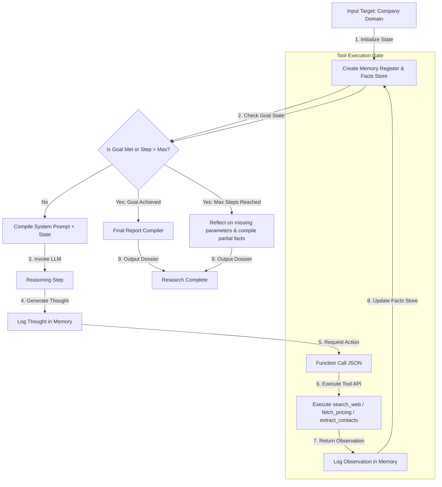

# GTM Agent Specification - Day 041: Lead Research Agent

This specification document outlines the architecture, planning loops, schemas, and tool definitions for the **Lead Research Agent (GTM Recon Agent)**.

---

## 🔄 ReAct Execution Loop Architecture

The diagram below details the agent's internal ReAct (Reasoning and Acting) execution loop, detailing how it handles tool execution and error recovery:



---

## 📋 Input & Output Schemas

### 1. Agent Input Schema (JSON)
The webhook trigger or API client initiates the agent with this input structure:
```json
{
  "company_domain": "waynecorp.com",
  "company_name": "Wayne Enterprises",
  "requested_by": "alex.m@arap.com",
  "force_enrich": false
}
```

### 2. Agent Output Schema (JSON)
The final generated dossier must comply with this schema:
```json
{
  "company_name": "Wayne Enterprises",
  "dossier": {
    "background": "A conglomerate specializing in aerospace, defense, and green energy...",
    "tech_stack": ["AWS", "React", "Python", "PostgreSQL"],
    "contract_value_estimate": 100000.00,
    "pricing_tier": "Custom Enterprise"
  },
  "contacts": [
    {
      "name": "Bruce Wayne",
      "title": "CEO",
      "email": "b.wayne@waynecorp.com"
    }
  ],
  "status": "Success",
  "execution_steps_count": 3
}
```

---

## 🛠️ Tool Specifications (JSON Schema)

### 1. Web Search Tool (`search_web`)
```json
{
  "name": "search_web",
  "description": "Searches Google for company background information, tech stacks, and recent press releases.",
  "parameters": {
    "type": "object",
    "properties": {
      "query": {
        "type": "string",
        "description": "The search query, e.g. 'Wayne Enterprises technology stack'."
      }
    },
    "required": ["query"]
  }
}
```

### 2. Pricing Scraper Tool (`fetch_pricing`)
```json
{
  "name": "fetch_pricing",
  "description": "Fetches and scrapes pricing tiers, subscription options, and contract values.",
  "parameters": {
    "type": "object",
    "properties": {
      "company": {
        "type": "string",
        "description": "The exact name of the company to extract pricing data for."
      }
    },
    "required": ["company"]
  }
}
```

### 3. Contacts Scraper Tool (`extract_contacts`)
```json
{
  "name": "extract_contacts",
  "description": "Extracts buyer contact details, names, and email addresses from the target domain.",
  "parameters": {
    "type": "object",
    "properties": {
      "domain": {
        "type": "string",
        "description": "The domain of the company, e.g. 'waynecorp.com'."
      }
    },
    "required": ["domain"]
  }
}
```

---

## 🧠 Memory & Observability Architecture

1.  **Context Window (Short-Term Memory)**:
    *   Maintained as a chronological array of messages. On each loop iteration, the full array is passed to the LLM core so it remembers previous search outcomes and does not repeat queries.
2.  **State Logs (Observability)**:
    *   The orchestrator saves the execution trace to `arap_database.db` under the `activities` table.
    *   Tracks: Step ID, Timestamp, LLM input/output tokens, Tool requested, Tool execution latency, and success status.
