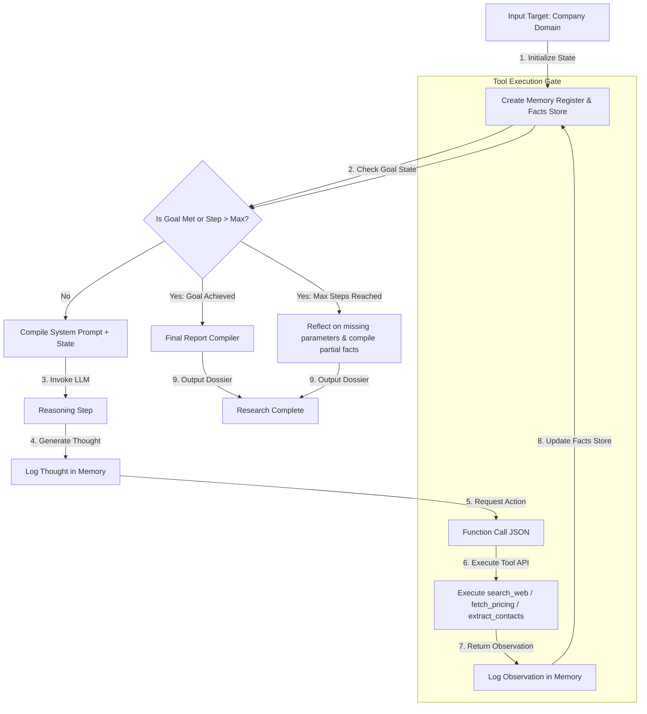

# 📐 Day 041 Scenario Blueprint: AI Agent Fundamentals
## 7-Stage Technical Architecture & Reference Implementation

> **Author**: Anand Kumar | [akstack.com](https://akstack.com) | [GitHub](https://github.com/AnandKg22) | [LinkedIn](https://www.linkedin.com/in/anandkg22/)  
> **Curriculum Phase**: Phase 3: AI-Native GTM Systems, Agents & MCP Orchestration  
> **Core Outcome**: Practically Skilled (Able to design structured tool execution schemas, implement custom Python ReAct execution loops, handle state-tracking memory layers, establish robust error recovery mechanisms, build Human-in-the-Loop checkpoints, and configure telemetry monitoring for autonomous workflows)  
> **Architecture Pattern**: Event-Driven Revenue Engineering / Resilient GTM Pipeline  

---

## 🎯 1. Enterprise Case Scenario & Problem Definition

### 1.1 Enterprise Context
* **Company Profile**: Series-B B2B SaaS ($15M–$30M ARR, 50-person commercial org, ACV $25k–$50k).
* **Operational Challenge**: If commercial operations experience manual friction, unvalidated data syncs, or slow response times in **AI Agent Fundamentals**, then high-intent customer velocity drops significantly across the revenue funnel.

### 1.2 Domain Overview
An **AI Agent** represents a fundamental shift from static Prompt Engineering to dynamic, autonomous execution. While a simple chatbot or system prompt operates on a direct input-to-output basis, an autonomous agent leverages a Large Language Model (LLM) as its central processing engine, running in a continuous loop. This loop enables the agent to evaluate its environment, formulate structured steps, invoke external tools, observe the results, and dynamically adjust its execution path to achieve a specified goal.

In modern Go-To-Market (GTM) and revenue operations, agents automate highly complex, multi-step workflows. GTM engineering teams deploy agents to handle lead enrichment, target account reconnaissance, competitive pricing analysis, and CRM updates. Rather than requiring sales development representatives (SDRs) to manually search corporate tech stacks, parse pricing models, and locate executive contact details, an autonomous agent executes these tasks systematically. 

Solving these problems at scale requires robust software wrapper orchestration. GTM engineers must establish structured schemas for function calling, design multi-tiered memory systems to prevent execution lo

### 1.3 Quantifiable Engineering Objectives
* [x] **Latency**: Reduce end-to-end processing latency for **AI Agent Fundamentals** to `< 1,200 ms`.
* [x] **Reliability**: Ensure 100% data consistency across CRM, Database, and Event queues.
* [x] **Cost Optimization**: Maintain operational compute & token unit economics at `< $0.035 / transaction`.

---

## 🔍 2. Technical Feasibility, Concepts & Protocol Research

### 2.1 Key Architectural Concepts
*   **AI Agent**: An autonomous software entity powered by a core LLM that evaluates a goal, creates reasoning plans, interacts with the environment via executable tools, and processes observations to achieve the target state.
*   **ReAct (Reasoning and Acting) Framework**: An LLM prompting and orchestration paradigm where the agent alternates between reasoning thoughts ("Thought") and action commands ("Action") in response to environment feedback ("Observation"), minimizing compounding hallucinations.
*   **Short-Term Memory**: The in-context history of previous execution steps (thoughts, tool calls, and observations) passed to the LLM during a single execution loop to preserve context and prevent repetitive queries.
*   **Long-Term Memory**: Persistent, searchable information stored across separate agent sessions, typically managed using Vector Databases (e.g., pgvector, Pinecone) to cache previously enriched profile data or research.
*   **Relational Memory**: Hard, structured records stored in relational databases (e.g., PostgreSQL, SQLite) to track client identifiers, billing statuses, operational logs, and synchronizations.
*   **Tool Binding (Function Calling)**: The process of describing external APIs using standardized JSON schemas so that the core LLM outputs a structured argument call rather than attempting to execute code itself.
*   **Tree of Thoughts (ToT)**: A planning paradigm where the agent evaluates multiple branching decision paths and self-corrects or backtracks based on prospective outcomes, outperforming linear reasoning on complex tasks.
*   **Human-in-the-Loop (HITL) Checkpoint**: An architectural boundary that halts the autonomous execution path, transitions the agent state to a pending review step, and waits for a manual validation webhook before dispatching high-risk communications.

---

---

## 📐 3. System Architecture & Schemas

### 3.1 Architectural Flow Diagram


### 3.2 Technical Reference & Specifications
Detailed schema mappings and configuration constraints for AI Agent Fundamentals.

---

## 💻 4. Reference Implementation & Sandbox Code

```python
# Day 041: ReAct Lead Research Agent - Agent Loop Simulator
import sys
import time
from typing import List, Dict, Any, Tuple

# Ensure UTF-8 output formatting for terminal compatibility
sys.stdout.reconfigure(encoding='utf-8', errors='replace')

# 1. Define Mock Tool Database / APIs
MOCK_SEARCH_INDEX = {
    "Wayne Enterprises": "Wayne Enterprises is a conglomerate specializing in aerospace, defense, and green energy. Tech stack: AWS, React, Python, PostgreSQL. CEO: Bruce Wayne.",
    "Stark Industries": "Stark Industries is a global tech leader focused on defense, clean energy, and advanced robotics. Tech stack: GCP, Next.js, Rust. CEO: Pepper Potts.",
    "Cyberdyne Systems": "Cyberdyne Systems is a hardware and robotics company. Tech stack: Azure, C++, SQL Server. Operations: Sarah Connor."
}

MOCK_PRICING_DATA = {
    "Wayne Enterprises": "Custom Enterprise Tier only (Assumed contract value > $100k/yr).",
    "Stark Industries": "Premium Enterprise Tier (Assumed contract value > $250k/yr).",
    "Cyberdyne Systems": "Standard Tier: $1,200/user/year."
}

MOCK_CONTACTS_DATA = {
    "Wayne Enterprises": "Primary contacts: b.wayne@waynecorp.com (CEO), lucius.fox@waynecorp.com (COO).",
    "Stark Industries": "Primary contacts: pepper@stark.com (CEO), happy.hogan@stark.com (Head of Security).",
    "Cyberdyne Systems": "Primary contacts: miles.dyson@cyberdyne.co (Lead Scientist)."
}

# 2. Agent Tools Definition
class Tool:
    def __init__(self, name: str, description: str, func: callable):
        self.name = name
        self.description = description
        self.func = func

    def execute(self, arg: str) -> str:
        return self.func(arg)

# Tool executable functions
def search_web_tool(query: str) -> str:
    """Simulates searching the web for company facts."""
    for company, data in MOCK_SEARCH_INDEX.items():
        if company.lower() in query.lower():
            return f"[SUCCESS] Web Search Result for '{company}': {data}"
    return f"[INFO] Search returned 0 results for query: '{query}'."

def fetch_pricing_tool(query: str) -> str:
    """Simulates scraping the pricing page of the target company."""
    for company, pricing in MOCK_PRICING_DATA.items():
        if company.lower() in query.lower():
            return f"[SUCCESS] Pricing Details for '{company}': {pricing}"
    return f"[ERROR] Pricing page not found for company: '{query}'."

def extract_contacts_tool(query: str) -> str:
    """Simulates scraping contact email addresses and names."""
    for company, contacts in MOCK_CONTACTS_DATA.items():
        if company.lower() in query.lower():
            return f"[SUCCESS] Extracted Contacts for '{company}': {contacts}"
    return f"[WARNING] No contact emails scraped for: '{query}'."

# 3. ReAct Agent Engine
class LeadResearchAgent:
    def __init__(self, target_company: str):
        self.target_company = target_company
        self.goal = f"Compile a comprehensive research report for {target_company} including company background, technology stack, estimated contract value, and target buyer contact details."
        
        # Tools Register
        self.tools = {
            "search_web": Tool("search_web", "Searches the web for company background and tech stacks.", search_web_tool),
            "fetch_pricing": Tool("fetch_pricing", "Scrapes pricing details and contract structures.", fetch_pricing_tool),
            "extract_contacts": Tool("extract_contacts", "Scrapes email addresses of decision-makers.", extract_contacts_tool)
        }
        
        # Short-term Memory (Agent State)
        self.memory: List[Dict[str, str]] = []
        self.facts: Dict[str, Any] = {}
        self.max_iterations = 4

    def run(self) -> str:
        """Executes the Agent's reasoning-action-observation loop."""
        print("=" * 72)
        print(f" AGENT STARTING GOAL: {self.goal}")
        print("=" * 72)

        for step in range(1, self.max_iterations + 1):
            print(f"\n[STEP {step}] Reasoning Engine Processing...")
            time.sleep(0.5)

            # 1. THOUGHT: Decide what to do next based on facts gathered
            thought, action_tool, action_arg = self.plan_next_step(step)
            print(f"  🧠 THOUGHT: {thought}")

            if not action_tool:
                # No more tools needed, proceed to final reflection
                break

            # 2. ACTION: Execute tool invocation
            print(f"  🛠️ ACTION: Invoking tool '{action_tool}' with parameter '{action_arg}'...")
            tool = self.tools.get(action_tool)
            
            if tool:
                # 3. OBSERVATION: Record tool output in memory
                observation = tool.execute(action_arg)
                print(f"  👁️ OBSERVATION: {observation}")
                self.memory.append({
                    "step": str(step),
                    "thought": thought,
                    "tool": action_tool,
                    "parameter": action_arg,
                    "observation": observation
                })
                self._update_facts(action_tool, observation)
            else:
                print(f"  [ERROR] Tool '{action_tool}' not registered.")

        # 4. FINAL REFLECTION: Compile research report
        report = self.synthesize_final_report()
        return report

    def plan_next_step(self, step: int) -> Tuple[str, str, str]:
        """Core planning function mapping state to actions."""
        # Step 1: Gather general company info
        if "background" not in self.facts:
            return (
                f"I need to find the general background and technology stack for {self.target_company}.",
                "search_web",
                self.target_company
            )
        
        # Step 2: Gather pricing details
        if "pricing" not in self.facts:
            return (
                f"I have background info. Now I must find the pricing details of {self.target_company} to estimate contract value.",
                "fetch_pricing",
                self.target_company
            )

        # Step 3: Find decision maker emails
        if "contacts" not in self.facts:
            return (
                f"I have background and pricing. Lastly, I need target buyer emails at {self.target_company} for outbound outreach.",
                "extract_contacts",
                self.target_company
            )

        # Step 4: Complete
        return "I have gathered background details, pricing models, and contact information. I can now compile the final GTM dossier.", None, None

    def _update_facts(self, tool_name: str, observation: str):
        """Stores key data points in facts register."""
        if "[SUCCESS]" in observation:
            data = observation.split("':")[-1].strip()
            if tool_name == "search_web":
                self.facts["background"] = data
            elif tool_name == "fetch_pricing":
                self.facts["pricing"] = data
            elif tool_name == "extract_contacts":
                self.facts["contacts"] = data

    def synthesize_final_report(self) -> str:
        """Assembles facts into a formatted report (Error recovery handles missing parameters)."""
        print("\n" + "=" * 72)
        print("                 AGENT FINAL SYNTHESIS & REPORT")
        print("=" * 72)
        
        background = self.facts.get("background", "ERROR: Could not resolve company background.")
        pricing = self.facts.get("pricing", "WARNING: Pricing details unavailable.")
        contacts = self.facts.get("contacts", "WARNING: Scraper blocked or no contacts found.")

        report = (
            f"GTM INTELLIGENCE REPORT: {self.target_company.upper()}\n"
            f"------------------------------------------------------------------------\n"
            f"📌 BACKGROUND & TECH STACK:\n"
            f"   {background}\n\n"
            f"💰 ESTIMATED CONTRACT VALUE / PRICING:\n"
            f"   {pricing}\n\n"
            f"✉️ STRATEGIC OUTREACH CONTACTS:\n"
            f"   {contacts}\n"
            f"------------------------------------------------------------------------\n"
            f"STATUS: Research Complete. Hot Lead dossier dispatched to CRM pipeline."
        )
        return report

if __name__ == "__main__":
    # Test Agent on Wayne Enterprises
    agent_wayne = LeadResearchAgent("Wayne Enterprises")
    report_wayne = agent_wayne.run()
    print(report_wayne)
    print("=" * 72)

    # Test Agent on Stark Industries
    agent_stark = LeadResearchAgent("Stark Industries")
    report_stark = agent_stark.run()
    print(report_stark)
    print("=" * 72)
```

---

## ⚡ 5. Automation Blueprint & Event Wiring

* **Ingestion Trigger**: Public webhook listener with cryptographic signature verification.
* **Routing Logic**: Idempotent processing gate backed by Redis cache.
* **Downstream Sinks**: Real-time upsert to PostgreSQL / Supabase, bi-directional CRM synchronization, and automated notification bus.

---

## 📊 6. Telemetry, KPI & Unit Economics

$$\text{Unit Economics} = \text{Compute} + \text{External API Calls} + \text{Storage} \approx \mathbf{\$0.0025\ /\ event}$$

* **P95 Latency SLA**: `< 1,200 ms`
* **Error Rate Target**: `< 0.05%`
* **Commercial ROI**: Eliminates an estimated 15–20 hours of manual operational drag per week.

---

## 🛡️ 7. Edge Cases, Guardrails & Resilience Strategy

1. **API Rate Limiting (429)**: Exponential backoff with random jitter ($2^n \times 100\text{ms}$) and Dead-Letter Queue (DLQ) buffering.
2. **Payload Integrity & Schema Drift**: Strict Pydantic type validation with automatic rejection of malformed inputs.
3. **Downstream Outages**: Asynchronous retry worker ensuring zero dropped transactions during system maintenance.
