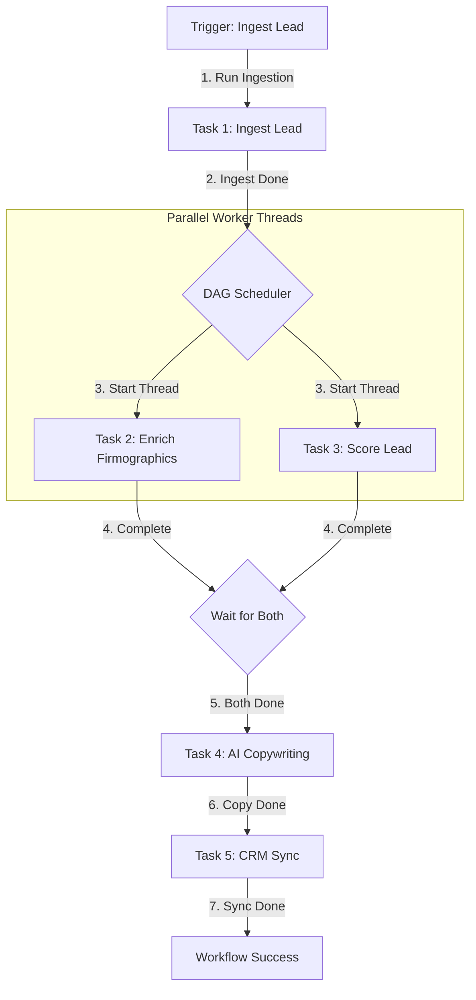
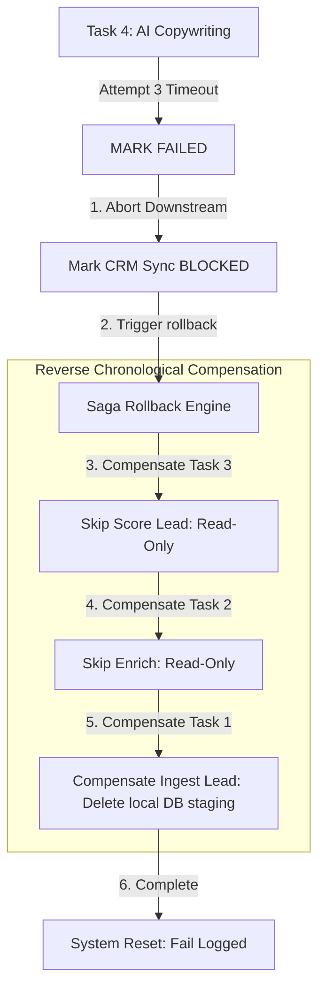

# GTM Architecture - Day 043: Workflow Orchestrator

This document details the scheduling engine, concurrency models, and rollback logic supporting GTM workflow orchestration.

---

## 🔄 Concurrency & DAG Execution Pipeline

The diagram below details the pipeline, showing how independent tasks are executed in parallel while dependent nodes wait for completion:

---

## 🔄 Saga Rollback Pipeline (Backward Recovery)

The diagram below outlines the sequence triggered when a task fails (e.g. AI Copywriting exceeds its 1.0s timeout limit) and exhausts all retries:

---

## ⚙️ Orchestration Core Components

1.  **DAG Scheduler**: Analyzes task metadata and dependencies to build a topological execution order. Identifies sibling nodes that can run concurrently.
2.  **Worker Thread Pool**: Utilizes Python's `ThreadPoolExecutor` to manage asynchronous worker threads, running task functions concurrently.
3.  **Context Registry**: A shared data dictionary (`self.context`) that aggregates task outputs. Downstream tasks read variables (e.g., `tech_stack` or `fit_score`) produced by upstream tasks.
4.  **Saga Rollback Engine**: An error interceptor that pauses threads upon execution failures, cancels downstream scheduling, and traverses completed tasks backward to call compensation handlers.
